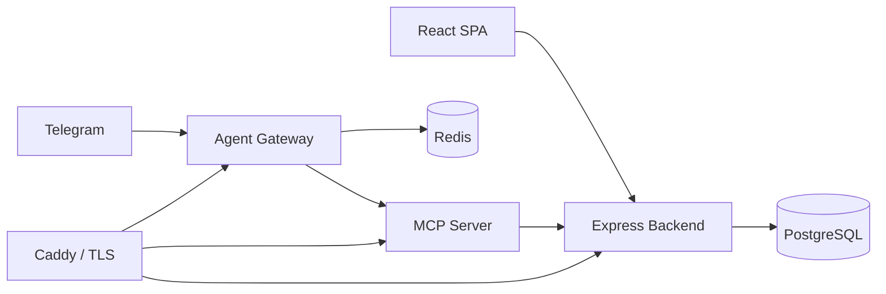

# Integrated HR and Product System (HRP)

HRP is a TypeScript monorepo for workforce operations and product delivery. It combines employee administration, scheduling and attendance, employee requests and approvals, payroll, recruitment, projects/tasks, and an authenticated AI assistant.

## System at a glance

| Package | Purpose | Development endpoint |
|---|---|---|
| `frontend` | React operational web application | `http://localhost:5173` |
| `backend` | Express REST API and scheduled workflow engine | `http://localhost:5000` |
| `mcp-server` | MCP tool server for governed HRP automation | `http://localhost:3001` |
| `agent-gateway` | Telegram AI assistant gateway | `http://localhost:3002/health` |

Core platform services are PostgreSQL (through Prisma) and Redis (for AI gateway sessions/history). Production ingress is handled by Caddy.

## Capabilities

- Workforce, contracts, employee profiles, dynamic RBAC and audit logs.
- Shifts, schedules, attendance, holidays, part-time availability and employee requests.
- Configurable salary components, payroll runs, payslips and payroll automation.
- Requisitions, job postings, candidate intake, interviews, scorecards, offers and background checks.
- Projects, tasks, time records, Gantt/Kanban views and advisory capacity forecasting.
- MCP tools and Telegram AI assistant access bound to authenticated HRP sessions.

## Architecture



The backend follows `Route → Controller → Service → Repository → Prisma/PostgreSQL`. Authentication establishes identity with JWT/cookies; dynamic roles and permissions govern access.

## Prerequisites

- Node.js/Bun runtime compatible with package-level scripts.
- `ni` and `nr` from `@antfu/ni` are recommended; they select the local package manager from the nearest lockfile.
- PostgreSQL database. Supabase PostgreSQL is supported by the supplied environment template.
- Redis, Telegram bot credentials, and an OpenAI-compatible provider only when running the AI assistant.

## Local setup

1. Copy environment templates and supply local secrets:

   ```powershell
   Copy-Item backend/.env.example backend/.env
   Copy-Item frontend/.env.example frontend/.env
   Copy-Item mcp-server/.env.example mcp-server/.env
   Copy-Item agent-gateway/.env.example agent-gateway/.env
   ```

2. Install each package using `ni` (or the package manager indicated by its lockfile):

   ```powershell
   nr i:backend
   nr i:frontend
   nr i:mcp
   nr i:gateway
   ```

3. Generate Prisma client and apply database migrations:

   ```powershell
   nr db:generate
   nr db:deploy
   ```

4. Start the development stack:

   ```powershell
   nr dev
   ```

`nr dev` starts backend, frontend, MCP server and agent gateway concurrently. Use `nr dev:stage` when the gateway is not required.

## Common commands

| Command | Purpose |
|---|---|
| `nr dev` | Start backend, frontend, MCP and gateway |
| `nr dev:stage` | Start backend, frontend and MCP |
| `nr dev:backend` / `dev:frontend` / `dev:mcp` / `dev:gateway` | Start one package |
| `nr db:generate` | Generate Prisma client |
| `nr db:deploy` | Apply committed migrations |
| `nr db:migrate` | Create/apply a development migration |
| `nr db:studio` | Open Prisma Studio |
| `nr db:seed` | Seed incrementally |
| `nr db:seed:fresh` | Clear and seed database data |
| `nr build:frontend` | Type check and build frontend |

> `nr db:reset`, `nr db:reset:force`, `nr db:clear`, and `nr db:seed:fresh` are destructive. Do not use them with production data.

## Documentation

Start here:

- [Enterprise project documentation](docs/enterprise-project-documentation.md) — complete architecture, data, workflows, security, operations and risk baseline.
- [System architecture](docs/system-architecture.md) — concise implementation architecture and request flows.
- [Codebase summary](docs/codebase-summary.md) — package and source ownership map.
- [API guide](docs/api-docs.md) — API conventions and route-family catalog.
- [Interface contracts](docs/interface-contracts.md) — response, validation and DTO conventions.
- [Frontend design specification](docs/frontend-design-spec.md) — UI tokens and component rules.
- [Code standards](docs/code-standards.md), [SOLID](docs/solid-principles.md), and [design patterns](docs/design-patterns.md) — engineering conventions.

## Deployment

`docker-compose.prod.yml` deploys Caddy, Redis, backend, MCP server and agent gateway. GitHub Actions builds images to GHCR, runs Prisma migrations on the EC2 target, starts the Compose stack, and checks health endpoints. See the enterprise document for the operational model and rollback procedure.

## Security

Never commit database URLs, JWT secrets, OAuth credentials, Telegram tokens, AI API keys or private keys. Use deployment secret storage and separate credentials per environment. The security controls and outstanding operating requirements are documented in the [enterprise project documentation](docs/enterprise-project-documentation.md).
