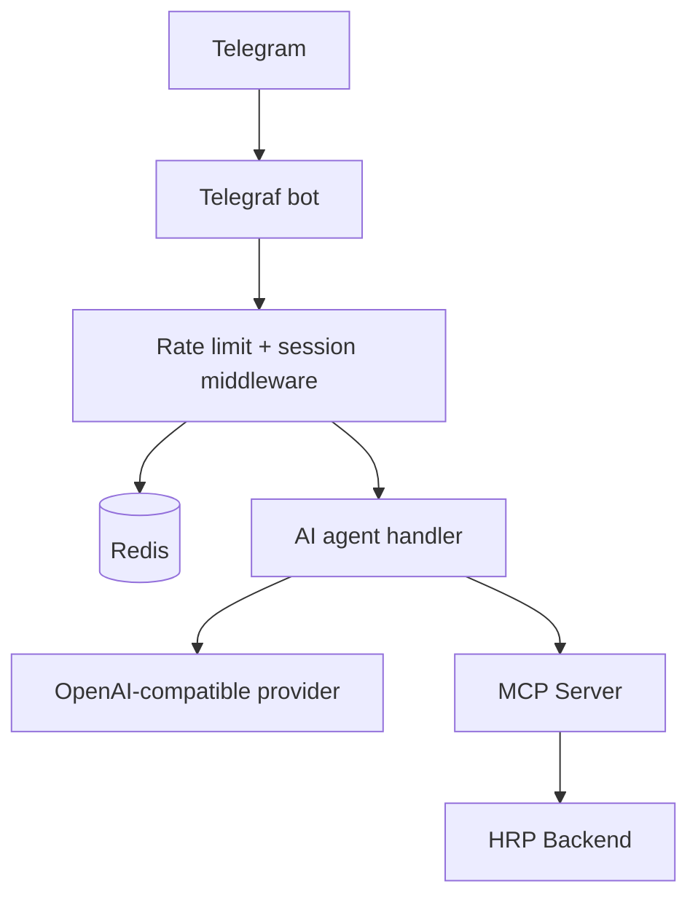

# HRP Agent Gateway

Telegram-facing AI assistant for HRP. The gateway connects Telegram users to the MCP server without exposing backend credentials or MCP session IDs to the language model/user.

## Runtime flow



For each message, the gateway loads bounded history, retrieves MCP tools, converts their JSON schemas to AI SDK Zod tools, invokes the model, injects a server-held session ID into protected MCP calls, then stores the new history and returns the answer.

## Safeguards

| Control | Current behavior |
|---|---|
| Telegram ingress | Redis-backed limit of one message per user per second |
| Login handoff | Browser-mediated MCP login; no password collection in Telegram chat |
| Session retention | Redis session TTL of eight hours |
| Conversation retention | Last 20 messages, 24-hour TTL |
| Tool execution | Session ID injected server-side; login tools are session-exempt |
| Agent loop | Maximum five tool-use steps and configurable abort timeout |
| Startup | Fails fast when Redis or MCP connectivity is unavailable |

## Local setup

```powershell
Copy-Item .env.example .env
pnpm install
pnpm dev
```

Required configuration categories:

- `TELEGRAM_BOT_TOKEN`
- `NINE_ROUTER_BASE_URL`, `NINE_ROUTER_API_KEY`, `NINE_ROUTER_MODEL`
- `MCP_SSE_URL`, `MCP_MESSAGE_URL`
- `REDIS_URL`
- `PORT`, `AGENT_TIMEOUT_MS`, and `NODE_ENV`

The health endpoint is `GET /health` on the configured port.

## Commands

```powershell
pnpm dev
pnpm build
pnpm typecheck
pnpm lint
pnpm start
```

From the repository root, use `nr dev:gateway` to run this package. Docker Compose runs the gateway with Redis and MCP in the same internal network.

## Operational rules

- Do not log credentials, tokens, raw HR payloads or unredacted model prompts in production.
- Treat MCP tool schemas and authorization responses as mandatory controls; do not add direct backend calls from the bot handler.
- Preserve the separation between authentication flow, model orchestration, Redis state and MCP transport.
- Add regression tests when changing session expiry, rate limits, tool injection or error classification.

See [the root enterprise documentation](../docs/enterprise-project-documentation.md) for deployment, security and data-handling context.
