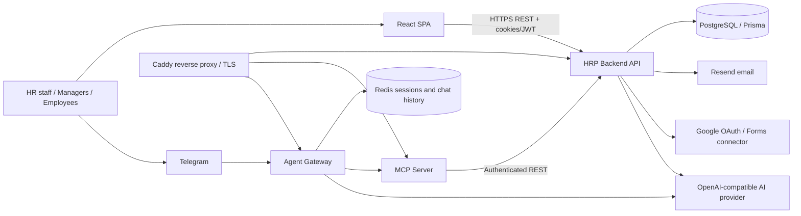
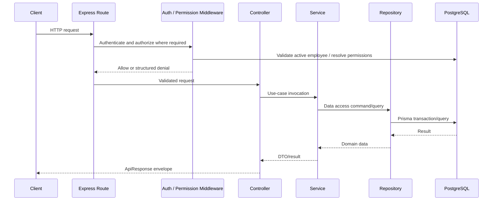
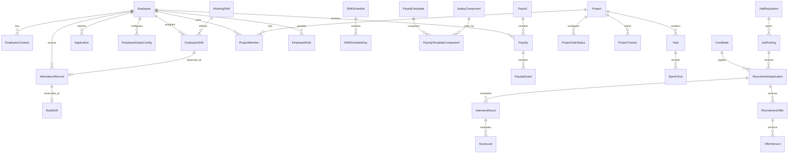
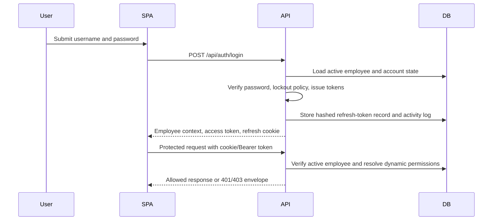

# Integrated HR and Product System

## Enterprise System Documentation

**Document status:** Code-backed baseline  
**Last reviewed:** 2026-08-04  
**Audience:** Product owners, engineering teams, QA, operations, security reviewers, and integration partners  
**System of record:** Repository implementation and Prisma schema

> This document describes the implementation currently present in the repository. Statements tagged **Recommendation** are target-state practices, not claims about deployed behavior. Older documents that describe a placeholder backend are historical and must not be used as an implementation authority.

## 1. Executive Summary

Integrated HR and Product System (HRP) is a modular web platform that combines workforce administration, attendance and scheduling, employee requests and approvals, payroll, recruitment, project delivery, and AI-assisted operations. It is implemented as a TypeScript monorepo with four deployable applications:

| Component | Responsibility | Primary technology |
|---|---|---|
| `frontend` | Browser-based operational UI | React 19, Vite, React Router, React Query, Zustand, Tailwind/shadcn primitives |
| `backend` | Authoritative HRP REST API and workflow engine | Express 5, Prisma, PostgreSQL, Zod, JWT |
| `mcp-server` | Model Context Protocol facade for governed HRP tool use | MCP SDK, Express, SSE/stdio |
| `agent-gateway` | Telegram-facing AI assistant gateway | Telegraf, Vercel AI SDK, Redis, OpenAI-compatible provider |

The application is designed around business capabilities rather than a single generic CRUD surface. Key workflows use explicit status models, dynamic role/permission authorization, auditable decisions, server-side validation, and scheduled background automation.

## 2. Business Capabilities

| Capability | Implemented scope |
|---|---|
| Workforce and identity | Employee lifecycle, profiles, positions, contracts, account security, dynamic roles and permissions, authorization audit trail |
| Attendance and scheduling | Working shifts, recurring schedule templates, schedules, assigned shifts, check-in/out, actual shift records, attendance metrics, holidays and part-time availability |
| Requests and approvals | Leave, overtime, shift swap, late/early, business trip, work-from-home, regime and recruitment-related applications with approval processing |
| Payroll | Salary components/variables/templates, employee salary configuration, payroll periods, payslips/details, feedback and scheduled generation/approval |
| Recruitment | Requisitions, job postings, candidate intake, OAuth-backed connectors, candidates, pipeline stages, interviews, scorecards, offers/versioning and background checks |
| Project delivery | Projects, members, roles, task statuses, tasks, trackers, Gantt data, time records and capacity forecasting |
| AI-assisted operations | MCP tool access to HRP workflows and a Telegram assistant with authenticated, session-bound tool execution |

## 3. Architectural Principles

1. **Authoritative backend.** Browser and AI clients call the backend through controlled adapters; business data belongs to PostgreSQL through Prisma.
2. **Layered backend.** HTTP routes compose controllers; controllers delegate to services; services use repositories and domain utilities; Prisma is isolated in repositories and runtime libraries.
3. **Validation at boundaries.** Zod schemas validate HTTP and MCP input models. The global Express error handler converts application and validation errors to a structured response.
4. **Dynamic authorization.** JWT establishes identity; authorization is re-evaluated from active employee state and dynamic role/permission assignments.
5. **Workflow integrity.** Status values and transition routes are domain-specific. Generic update endpoints are intentionally restricted for workflow-sensitive fields in modules such as recruitment.
6. **Session-bound AI access.** The AI gateway never asks an end user for an MCP session ID; it injects the server-held session into tool calls.

## 4. Logical System Context



### 4.1 Deployment topology

The production Compose configuration deploys Caddy, Redis, backend, MCP server, and agent gateway. Backend/MCP/gateway are exposed to the internal Docker network; Caddy is the public ingress on ports 80 and 443. Images are pulled from GitHub Container Registry (GHCR). The frontend is built separately as a Vite application and may be deployed through Vercel's configured frontend service or another static hosting provider.

| Ingress route | Target | Purpose |
|---|---|---|
| `/api/*` | Backend port 5000 | HRP REST API |
| `/mcp/*` | MCP port 3001 | SSE transport, JSON-RPC messages and browser login |
| `/gateway/health` | Gateway port 3002 | Gateway health probe |
| `/health` | Caddy | Edge health probe |

The Caddy configuration enables gzip/zstd and applies `X-Content-Type-Options: nosniff`, `X-Frame-Options: DENY`, and `Referrer-Policy: no-referrer`.

## 5. Component Architecture

### 5.1 Backend service

The backend initializes configuration, database connectivity, CORS, cookie parsing, JSON parsing, route modules, a not-found handler, and global error handling. It connects to PostgreSQL before listening, verifies role configuration, bootstraps an administrator when needed, and starts scheduled jobs only after startup succeeds.



Backend modules are mounted under `/api` and grouped as follows:

| API family | Base path | Responsibilities |
|---|---|---|
| Authentication and security | `/auth`, `/security`, `/permissions`, `/roles`, `/positions` | Login/session lifecycle, password reset, security reporting, RBAC configuration |
| Workforce | `/employees`, `/employee-contracts`, `/profile` | Employee records, salary configuration path nesting, contracts and self-service profile |
| Attendance and requests | `/shifts`, `/schedules`, `/attendance`, `/applications`, `/shift-change-requests`, `/holidays`, `/regime-categories`, `/weekly-schedule-templates`, `/part-time-availabilities`, `/approvals` | Scheduling, clocking, requests and their approval workflow |
| Recruitment | `/recruitment` | Requisitions through background checks, including connector and OAuth management |
| Compensation | `/salary-components`, `/salary-variables`, `/payslip-templates`, `/payrolls` | Configurable payroll calculation and employee payslips |
| Delivery and analytics | `/projects`, `/tasks`, `/task-estimate-ai`, `/capacity-copilot`, `/spent-times`, `/custom-queries` | Projects, task execution, estimates, capacity forecasting and reporting |
| Operations | `/activity-logs`, `/debug` | Auditing and diagnostics; debug routes must be restricted operationally |

### 5.2 API response contract

Successful and failed business responses use an envelope compatible with:

```ts
type ApiResponse<T> = {
  data: T | null
  error: {
    message: string
    code: string
    meta?: unknown
  } | null
  meta?: unknown
}
```

`AppError` carries an HTTP status, error layer, and error code. The global error middleware serializes application errors and Zod failures; unhandled faults return an internal-error envelope. Consumer code should branch on `error`, never on an English/Vietnamese message string.

### 5.3 Backend module ownership

| Layer | Responsibility | Conventions |
|---|---|---|
| Routes | Bind HTTP verb/path, authentication, permission guards and controller | No business rules |
| Controllers | Translate HTTP request/response to service calls | No Prisma queries |
| Services | Enforce workflow, calculation and cross-entity business rules | Constructor-injected repository dependencies where implemented |
| Repositories | Isolate Prisma persistence and query composition | No HTTP coupling |
| Schemas | Zod DTO validation at public boundaries | Reuse central enum value arrays/configuration |
| Config/constants | Canonical roles, statuses, permissions, HTTP and rules | Avoid inline business strings |
| Libraries/jobs | Database/runtime integration and scheduled processes | Startup only after DB connection |

## 6. Data Architecture

### 6.1 Persistence technology

PostgreSQL is accessed with Prisma 7 using the `@prisma/adapter-pg` adapter and a `pg` connection pool. The connection configuration supports direct and pooled URLs, including Supabase-style PostgreSQL URLs. Production database SSL is enabled by environment-sensitive configuration.

Prisma schema migrations live in `backend/prisma/migrations`; deployment runs `prisma migrate deploy` before the new services are brought up.

### 6.2 Domain data map



### 6.3 Domain aggregates

| Domain | Principal models | Integrity purpose |
|---|---|---|
| Workforce | `Employee`, `EmployeeContract`, `Position`, leave balance | Employment identity, contractual and organizational context |
| Time and attendance | `WorkingShift`, schedule/template models, `EmployeeShift`, `AttendanceRecord`, `RealShift`, holiday models | Planned versus observed work and exception data |
| Requests | `Application` plus subtype detail models, `RegimeCategory`, approvals | Typed request payloads and controlled decisions |
| Payroll | Salary component/template/config/variable models, `Payroll`, `Payslip`, `PayslipDetail`, settings | Repeatable, itemized period calculations |
| Projects | `Project`, `ProjectMember`, `Task`, `ProjectTaskStatus`, `ProjectRole`, `ProjectTracker`, `SpentTime` | Delivery planning, contribution and capacity inputs |
| Authorization/audit | `AppRole`, `Permission`, `RolePermission`, `EmployeeRole`, `AuthorizationAuditLog`, `ActivityLog`, `RefreshToken` | Dynamic access policy and accountability |
| Recruitment | Requisition/posting/candidate/application/pipeline/interview/offer/background-check models | Full applicant lifecycle and connector traceability |

## 7. Identity, Session, and Authorization

### 7.1 Web authentication flow



Implemented controls include:

- bcrypt password verification and generic invalid-credential responses to reduce user enumeration.
- Failed-login counting with a lockout threshold and notification email attempt.
- JWT access/refresh tokens with token versioning; refresh tokens are stored as SHA-256 hashes.
- Refresh-token rotation, a short multi-tab grace period, and global revocation on detected post-grace token reuse.
- Password-reset requests with expiry and non-production diagnostic behavior.
- Cookie-first authentication with Bearer fallback for API clients.
- Employee status revalidation on authenticated requests.

### 7.2 Dynamic RBAC

Roles and permissions are persisted in database tables rather than encoded as static route roles. A request is authenticated first; `authorizationService` then resolves the employee's current roles and permissions. Permission middleware provides `requirePermission`, `requireAnyPermission`, `requireAllPermissions`, and role checks. A dynamic administrator bypass is explicitly logged. Denial is the default decision.

The frontend caches roles and permissions for UI behavior but treats them as untrusted after reload: protected routing calls `/auth/me`, fails closed when authorization cannot be confirmed, and sends users without required access to a safe self-service route.

### 7.3 Auditability

The system includes activity logs, authorization decision logs, refresh-token state, and security-oriented reporting routes. Business workflows should record actor identity through authenticated request context; audit data must be retained and access-controlled according to organizational policy.

## 8. Core Workflow Design

### 8.1 Attendance, schedule and approvals

The attendance domain separates planned shifts from actual attendance. Weekly templates and shift schedules produce employee shifts; clocking and attendance operations create records; actual/real-shift data supports reconciliation. Part-time availability is modeled separately from full-time scheduling, allowing part-time employees to declare availability that administrators can use for assignment.

Employee applications use a base application model with typed detail records for leave, shift swap, overtime, regime, late/early, business trip, work from home, recruitment, and forgot-card cases. Approval routes and approval strategies process decisions rather than relying only on a mutable status field.

Background automation evaluates configured weekly scheduling settings every minute and generates the applicable week once, using the persisted generated-week key as an idempotency guard.

### 8.2 Payroll

Payroll configuration is model-driven:

- Salary components define additions and deductions.
- Salary variables provide reusable calculation inputs.
- Payslip templates compose components and may supply formula overrides.
- Employee salary configurations choose a template and effective period.
- Payrolls represent a period-level run; payslips and payslip details preserve employee-level outputs.

The payroll service is responsible for assembling attendance, salary configuration, approved part-time work/time data, formula input and calculations. Payroll generation uses transaction-oriented logic and validates workflow status before approval/rejection. The scheduled job checks configured trigger and approval times, guards duplicate period generation, and does not auto-approve rejected payrolls.

### 8.3 Recruitment

Recruitment is an explicit pipeline, not an employee form extension:

1. Create and submit a requisition; authorized users review, approve, close, or delete through dedicated transitions.
2. Create job descriptions/postings and configure ordered recruitment stages.
3. Capture candidates through intake records and connector responses, including Google OAuth-backed account management.
4. Move applications through an auditable pipeline; record notes, posting/requisition activity and stage history.
5. Schedule and complete interviews; capture structured scorecards.
6. Create, version, send, respond to, rescind or expire offers.
7. Start, complete and track background checks before final hiring action.

Recruitment APIs use fine-grained permission codes such as recruitment read/create/update/delete, posting management, requisition approval and intake management. Generic request schemas reject workflow-state mutation where a dedicated transition endpoint is required.

### 8.4 Project and capacity management

Projects support membership, project roles, configurable task statuses, trackers, tasks, Gantt data and time records. Capacity Copilot forecasts available capacity from full-time standard weekly hours or part-time submitted availability. Its output is advisory: scheduled refreshes cache forecasts and do not automatically staff projects.

## 9. Frontend Architecture and UX

### 9.1 Composition

The frontend is a React Router single-page application. Public pages cover login and password reset. Private routes are lazy-loaded and rendered inside shared layouts. Route configuration attaches required permission/role metadata, which `ProtectedRoute` evaluates after authorization revalidation.

| Concern | Implementation |
|---|---|
| Routing | React Router, lazy imports, nested layouts and explicit legacy redirects |
| Server state | TanStack React Query with retry disabled and no refetch-on-window-focus by default |
| Client state | Zustand persisted authentication cache plus sidebar/subsystem stores |
| Transport | Axios instance with credentials, access token interceptor and serialized refresh queue |
| Forms | React Hook Form with Zod resolver/schema patterns |
| Feedback | Sonner notifications, confirmation provider, loading states and error boundary |
| UI system | Tailwind CSS semantic tokens and shadcn/Radix-oriented primitives |

### 9.2 Navigation and access behavior

The application maintains a subsystem configuration for HR, attendance, payroll, recruitment, security and delivery areas. `resolveSubsystemDestination` selects a route the active user can access, so a restricted page does not become the default landing page. Page guards redirect unauthorised users to a self-service schedule route and surface authorization-service outages as retryable, fail-closed UI state.

### 9.3 Design system

The designated experience is a professional blue/slate enterprise UI with light mode as default, optional dark mode, Inter typography, semantic design tokens, and a mixed-radius design system:

- Interactive controls such as inputs, buttons and badges use pill radii.
- Top-level containers use rounded-xl; inner wrappers use rounded-lg.
- The layout targets comfortable operational density with clear tables, sticky headers and accessible feedback states.
- New frontend work must use semantic color tokens rather than raw color literals.

The authoritative UI rules are in `docs/frontend-design-spec.md`.

## 10. MCP and AI Assistant Architecture

### 10.1 MCP server

The MCP server is a governed tool adapter over HRP backend APIs. It supports two transports:

| Transport | Use case |
|---|---|
| SSE | Remote clients and reverse-proxy deployment through `/mcp/sse` and `/mcp/message` |
| stdio | Local-compatible MCP host integration |

Before starting, the server registers tools grouped by authentication, employee/workforce, attendance/scheduling, applications/approvals, payroll, projects, profiles, holidays, shifts and regimes. Browser-mediated login endpoints create a temporary login request, authenticate with HRP, create an MCP session, and permit tools to apply that session to backend calls.

### 10.2 Telegram agent gateway

The gateway is intentionally separated from the MCP server. It verifies Redis and MCP availability at startup, exposes a health endpoint, and runs a Telegraf long-polling bot. For each message it:

1. Enforces per-user ingress throttling.
2. Loads bounded chat history and the current server-side MCP session.
3. Converts MCP tool schemas to AI SDK Zod tools.
4. Calls an OpenAI-compatible provider with the fixed HR-agent instructions and a five-step tool-use maximum.
5. Injects the MCP session ID into non-auth tool requests.
6. Saves trimmed conversation history and returns the assistant response.

If the MCP service reports an expired session, the gateway clears Redis session/history and asks the assistant to guide the user through authentication again. The agent request uses an `AbortController` and configurable timeout.

### 10.3 AI security boundary

The LLM may select an MCP tool, but it does not receive raw backend credentials or user-managed session identifiers. MCP service calls are authenticated downstream and tool input is schema-shaped. This reduces, but does not eliminate, prompt-injection and over-privilege risk.

**Recommendation:** Add tool-level authorization regression tests, request/response audit correlation IDs, per-tool allowlists by bot role, output redaction for PII, and a production AI-data retention policy before processing sensitive HR data at scale.

## 11. Integration Catalog

| Integration | Direction | Purpose | Configuration boundary |
|---|---|---|---|
| PostgreSQL / Supabase | Backend ↔ database | Primary persistence | `DATABASE_URL`, `DIRECT_URL` |
| Resend | Backend → email | Password reset and account-lock notifications | `RESEND_API_KEY`, sender address |
| Google OAuth / Forms | Backend ↔ Google | Recruitment connector authorization and intake | Client ID/secret, encrypted credential key, state secret |
| OpenAI-compatible provider | Backend/Gateway → AI provider | Task estimation/capacity-related use cases and Telegram assistant generation | API key, base URL and model |
| Redis | Gateway ↔ Redis | Agent sessions, histories, login polling and throttling | `REDIS_URL` |
| Telegram | Gateway ↔ Telegram | Conversational HR assistant channel | `TELEGRAM_BOT_TOKEN` |
| MCP clients | MCP ↔ client | Tool-based AI/automation integration | Public base URL, SSE/message endpoints |

Secrets are supplied through environment files in deployment, not committed source. Rotating a secret should invalidate dependent sessions and be recorded through the incident/change process.

## 12. Operations and Runbooks

### 12.1 Local development

The root package provides orchestrated development scripts that start backend, frontend, MCP and gateway together. Each package can be run independently. The repository standard is to respect the local lockfile and use `nr`/`ni` when available.

Minimum environment preparation:

1. Create `.env` files from each package's `.env.example`.
2. Configure PostgreSQL connection URLs and JWT secrets for the backend.
3. Configure the frontend API base URL.
4. Configure MCP's HRP API and public base URL.
5. Configure gateway Telegram, AI-provider, MCP and Redis settings when testing the assistant.
6. Generate Prisma client and apply migrations before using backend business workflows.

### 12.2 Background jobs

| Job | Trigger model | Safety behavior |
|---|---|---|
| Payroll generation/approval | Polls every minute, acts only at configured time | Period/name duplicate guard; rejected payrolls are excluded from auto-approval |
| Weekly schedule generation | Polls every minute, acts only at configured weekday/time | Persisted last-generated week key prevents repeat generation |
| Capacity Copilot refresh | Polls every minute, acts only at configured weekly time | Process-local weekly guard; forecast is read-only/advisory |

**Operational note:** These are in-process schedulers. Horizontal scaling can create duplicate execution across backend replicas unless the deployment topology keeps a single scheduler leader or adds distributed locking.

### 12.3 Health checks

| Service | Endpoint | Expected response |
|---|---|---|
| Backend | `/health` | `{ status: "ok", service: "hrp-backend" }` |
| MCP | `/health` | `{ status: "ok", service: "hrp-mcp" }` |
| Gateway | `/health` | `{ status: "ok", service: "hrp-agent-gateway", ... }` |
| Edge | `/health` | HTTP 200 from Caddy |

### 12.4 CI/CD and rollback

Pull requests to `main` build Docker images for backend, MCP and gateway on a self-hosted Linux runner. A push to `main` builds/pushes tagged images to GHCR, copies production Compose/Caddy files to EC2, applies Prisma migrations, starts updated services, waits for health checks, and prunes old images. A manual rollback workflow selects a short commit SHA and one or all services, then pulls and starts the selected image tag.

**Recommendation:** Make unit tests, type checks, lint checks, dependency scanning, migration validation and frontend build explicit required CI jobs before deployment. Current PR workflow evidence is Docker build validation; it is not a substitute for behavioral gates.

## 13. Quality Strategy

The repository contains backend Jest suites across authentication, authorization, payroll, attendance, applications, schedules, recruitment, project/task services, caches, connector behavior and domain utilities. MCP includes API-contract, backend-coverage manifest and schema tests. Frontend includes route-destination behavior tests and Playwright configuration.

| Test level | Evidence in repository | Intended purpose |
|---|---|---|
| Unit/service | Backend `src/__tests__` | Business rules, calculations, workflow constraints and utility behavior |
| Contract/schema | MCP contract tests; Zod schema tests | Detect backend/tool mismatch and invalid external input |
| Middleware | CORS and authorization-related specs | Boundary and policy behavior |
| Frontend logic | Route destination test | Permission-aware navigation behavior |
| Browser E2E | Playwright configuration | End-to-end browser capability; no `frontend/e2e` specification directory was present at review time |

Recommended quality gates for a material change:

1. Run backend type checking and relevant Jest suites.
2. Run frontend type check/build, lint and style lint.
3. Run MCP contract tests after backend API changes.
4. Add Playwright coverage for a user-visible workflow, especially login, approval, payroll, recruitment state transitions and permission denial.
5. Validate migrations against a production-like database before release.

## 14. Security and Compliance Posture

### 14.1 Implemented controls

- TLS-capable Caddy ingress with defensive headers and proxy separation.
- Environment-based secrets for database, JWT, OAuth, email, AI and bot integrations.
- JWT plus refresh-token session lifecycle with token rotation/reuse detection.
- Active-account checks on authenticated requests and dynamic permission enforcement.
- Rate limiting on MCP browser-login endpoints and Redis-based Telegram message throttling.
- Zod boundary validation and structured error responses.
- Password hashing, login lockout, reset expiry, activity logging and authorization audit logging.
- Docker services run with health checks; backend container runs as a non-root Bun user.

### 14.2 Required operating controls

The codebase alone cannot establish legal or organizational compliance. The operating team must define and maintain:

- Data classification for employee, candidate, compensation and AI conversation data.
- Retention/deletion schedules for recruitment records, logs, token records and Redis history.
- Access-review cadence for privileged roles and break-glass administrator access.
- Vulnerability disclosure and incident response process. No standalone security policy is currently maintained in the repository.
- Backup, recovery, RPO/RTO objectives and periodic restoration verification for PostgreSQL.
- Privacy notices, consent basis and vendor agreements for AI, email, messaging and recruitment connector processing.

## 15. Known Architecture Boundaries and Improvement Backlog

| Priority | Observation | Recommended action |
|---|---|---|
| High | Existing `docs/system-architecture.md` and `docs/codebase-summary.md` describe obsolete stub architecture | Archive, rewrite or clearly mark them historical; direct readers to this document and current source |
| High | In-process cron jobs can duplicate work when backend replicas scale | Add distributed locking/leader election or move jobs to a dedicated scheduler/queue |
| High | No standalone vulnerability-disclosure policy is maintained | Publish support scope, reporting channel, response targets and disclosure process |
| High | Browser E2E config exists but no frontend E2E specs were found | Add Playwright scenarios to the required CI pipeline |
| Medium | CI PR workflow demonstrates image builds, but does not visibly run the full quality suite | Add required test, lint, typecheck, SAST/dependency and migration jobs |
| Medium | Sensitive HR data crosses email, Google, Telegram, AI-provider and Redis boundaries | Define data minimization, redaction, retention and vendor controls |
| Medium | Caddy and Nginx configurations coexist | Choose one production ingress standard and deprecate or document the alternate asset |
| Medium | Historical API/architecture documents may not all match current route contracts | Establish generated OpenAPI/contract publication from code or a release-gated reconciliation process |

## 16. Source-of-Truth Index

| Topic | Primary repository location |
|---|---|
| Backend bootstrap and mounted routes | `backend/src/index.ts` |
| Database schema and migrations | `backend/prisma/schema.prisma`, `backend/prisma/migrations/` |
| HTTP route contracts | `backend/src/routes/`, `backend/src/schemas/`, `backend/src/controllers/` |
| Business logic | `backend/src/services/` |
| Data access | `backend/src/repositories/` |
| Authorization and errors | `backend/src/middlewares/`, `backend/src/services/authorization.service.ts` |
| Payroll and schedule automation | `backend/src/libs/payroll-cron.ts`, `weekly-schedule-cron.ts`, `capacity-copilot-cron.ts` |
| Web routing and client access checks | `frontend/src/App.tsx`, `frontend/src/routes/`, `frontend/src/lib/api-client.ts` |
| UI design standard | `docs/frontend-design-spec.md` |
| MCP transport and tools | `mcp-server/src/server.ts`, `mcp-server/src/mcp.ts`, `mcp-server/src/tools/` |
| Telegram agent | `agent-gateway/src/` |
| Container deployment | `docker-compose.prod.yml`, `caddy/Caddyfile`, `.github/workflows/` |
| Tests | `backend/src/__tests__/`, `mcp-server/src/**/*.test.ts`, `frontend/tests/` |

## Appendix A: Environment Configuration Summary

| Package | Required configuration categories |
|---|---|
| Backend | Server/client URLs, database URLs, JWT/credential encryption secrets, CORS, email, Google OAuth and general AI provider |
| Frontend | Backend API base URL |
| MCP server | Port, HRP backend URL, public base URL and optional debug setting |
| Agent gateway | Telegram token, AI-provider base/key/model, MCP URLs, Redis URL, port and timeout |

Never commit real credentials, database connection strings, OAuth client secrets, bot tokens or production private keys. Use deployment-secret storage and environment-specific least-privilege credentials.

## Appendix B: Document Maintenance

Update this document when any of the following changes:

- A new backend route module, domain aggregate, workflow state or permission family is introduced.
- Prisma schema or migration changes alter a relationship, retention decision or integration contract.
- A client, MCP tool family, AI workflow or external connector is added/removed.
- Deployment topology, health endpoint, scheduler ownership, backup/RTO policy or CI gate changes.
- A security or compliance control is introduced, removed or materially changed.

Document owners should review the source-of-truth index and the architecture-boundary backlog at every release milestone.
