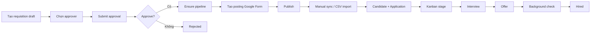
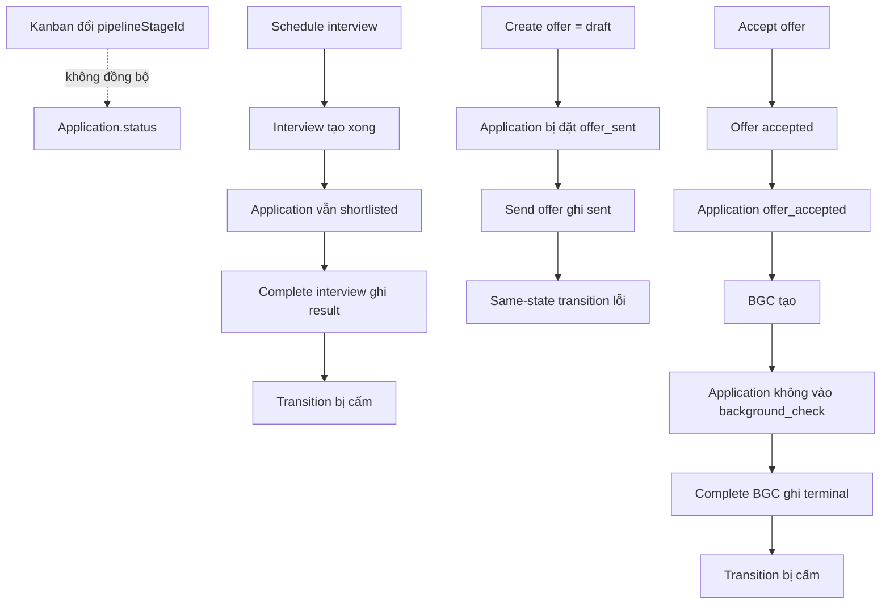
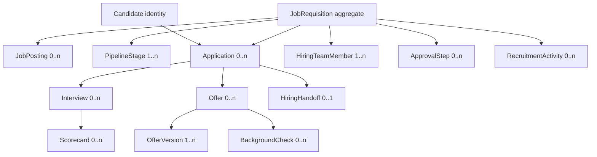
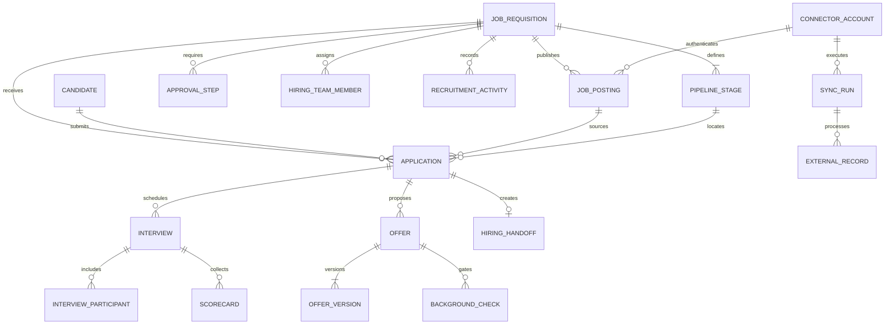
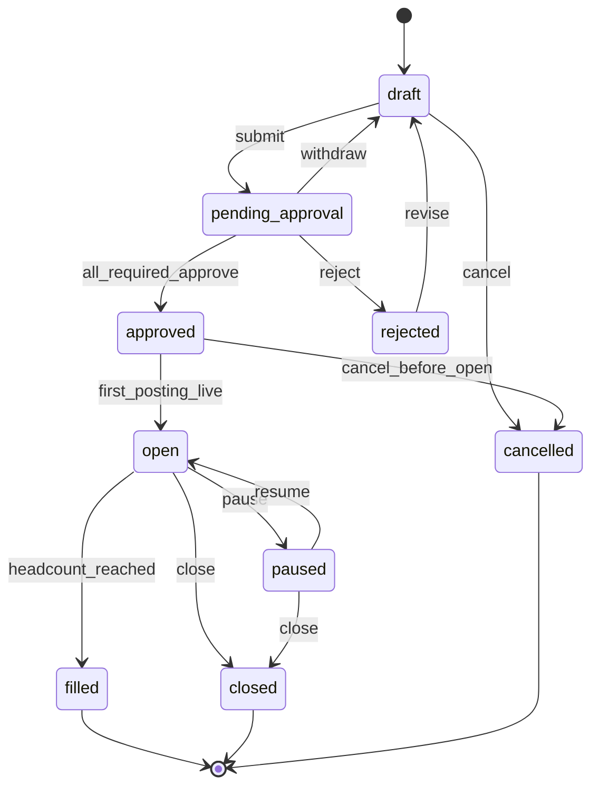
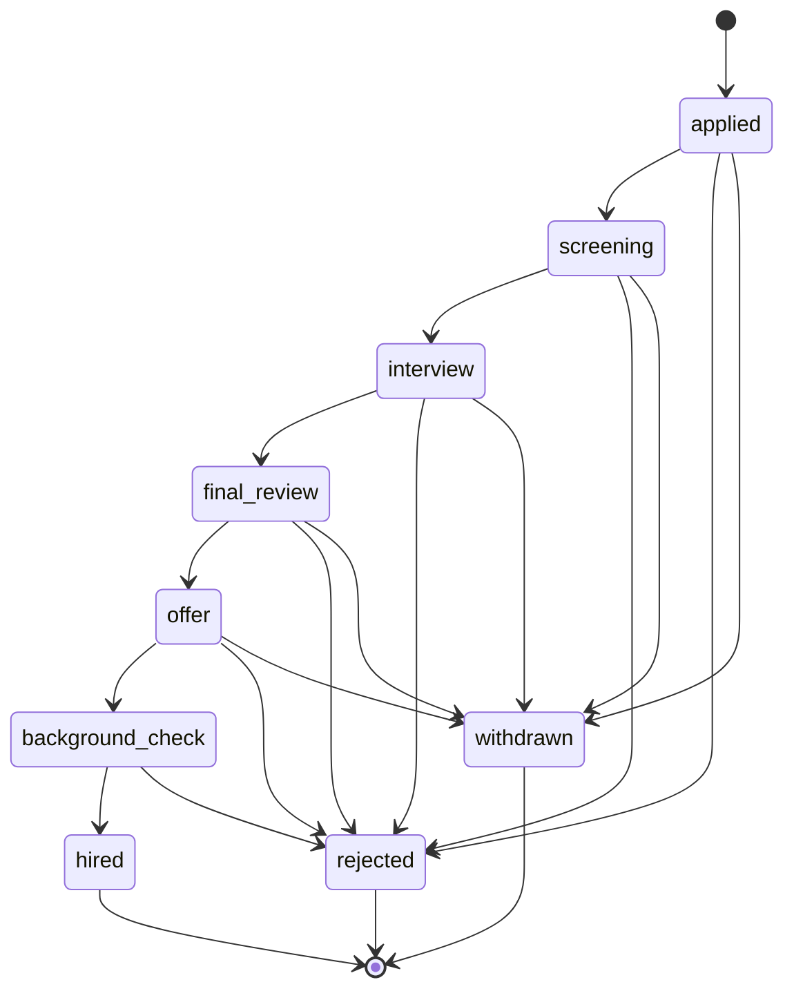
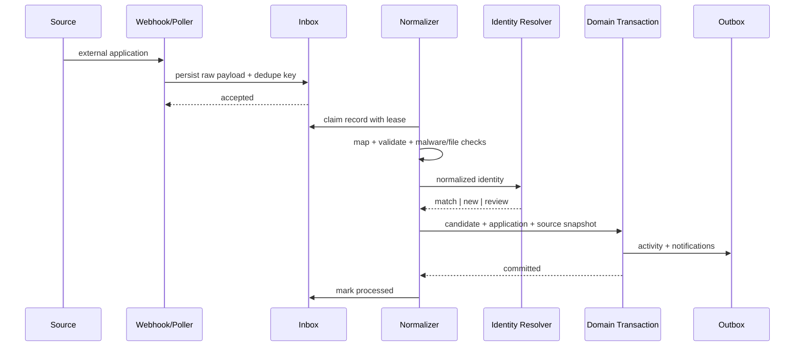

# Kế hoạch tổng thể hệ thống tuyển dụng — Audit, Operating Model, UX và Remediation

> Ngày: 2026-07-29  
> Trạng thái: implementation-ready plan  
> Phạm vi: `backend/`, `frontend/`, Prisma, connector, bảo mật, UX/UI, test, migration  
> Aggregate gốc: `JobRequisition`  
> Nguyên tắc: một nguồn sự thật, giao dịch nguyên tử, sync có thể retry, UI theo quyền

---

## 0. Kết luận nhanh

Module hiện tại chưa đủ an toàn để coi là một ATS hoàn chỉnh.

Static audit ghi nhận:

- 64 confirmed defects: 38 backend/system, 26 frontend.
- 10 design gaps lớn.
- 8 backend blocker trực tiếp ở workflow/OAuth/approval, cộng 1 CORS/CSRF blocker cấp hệ thống.
- Test coverage hiện tại gần như không bảo vệ domain tuyển dụng.

Có nền tốt:

- Requisition workspace đang đi đúng hướng.
- Có pipeline, posting, application, interview, offer, background check.
- Có Google Forms connector, import, activity và optimistic Kanban.
- Stack đủ mạnh để làm chuẩn: Express 5, Prisma, React 19, TanStack Query, Playwright.

Nhưng lõi đang gãy:

- `Application.status` và `pipelineStageId` là hai nguồn state riêng.
- Happy path interview, offer, background check có thể cập nhật nửa chừng rồi lỗi.
- Generic requisition update có thể bypass approval.
- OAuth secret/token lưu plaintext, API có đường trả full record.
- Có thể dùng OAuth account của user khác hoặc fallback account toàn hệ thống.
- Candidate không có public offer-response flow hợp lý.
- Multi-write command không transaction, không compare-and-swap, không idempotency.
- Frontend có route thiếu guard, Kanban thiếu quyền vẫn kéo được.
- Nhiều CTA nhìn như chạy nhưng thực tế không handler.
- Pagination/filter làm client-side trên một page server. Kết quả sai.
- Playwright hiện tại kiểm tra route/flow đã chết.

Quyết định đích:

1. Requisition là hiring project duy nhất.
2. Candidate là danh tính người; Application là hồ sơ ứng tuyển theo requisition.
3. `pipelineStageId` là state vận hành duy nhất. Stage có `stageType` chuẩn.
4. Mọi command nghiệp vụ chạy trong transaction và ghi outbox/activity cùng lúc.
5. Provider chỉ là adapter. Provider không sở hữu business state nội bộ.
6. MVP thực tế: career site + Google Forms + email + Google Calendar.
7. Microsoft Graph là phase tiếp theo.
8. LinkedIn/Indeed chỉ bật khi có partner approval/certification.
9. UX dùng Requisition Workspace làm nguồn thật; global pages chỉ là work queue.
10. Fix security/domain trước. Không đánh bóng UI trên state machine gãy.

---

## 1. Cách audit và nhãn bằng chứng

Ba nhãn được dùng:

| Nhãn | Nghĩa |
|---|---|
| `CONFIRMED DEFECT` | Code hiện tại chứng minh lỗi hoặc rủi ro |
| `DESIGN GAP` | Năng lực ATS cần có nhưng chưa được triển khai |
| `PROPOSED CAPABILITY` | Đề xuất phù hợp scope, không nói là code hiện tại lỗi |

Nguồn đã đọc:

- Prisma recruitment models.
- Routes, controllers, schemas, services, repositories backend.
- Routes, pages, hooks, queries, components, E2E frontend.
- `docs/solid-principles.md`.
- `docs/design-patterns.md`.
- `docs/frontend-design-spec.md`.
- Plan cũ về requisition workspace, Google Forms, candidate schema.
- Tài liệu chính thức Greenhouse, SAP, Workday, Google, Microsoft, LinkedIn, Indeed.
- Luật Bảo vệ dữ liệu cá nhân Việt Nam 91/2025/QH15, hiệu lực 2026-01-01.

Giới hạn audit:

- Danh sách dưới đây là toàn bộ lỗi quan sát được bằng static audit trong phạm vi module.
- Runtime verification đang bị chặn bởi dependency installation hỏng. Không giả vờ test xanh.
- Không đánh đồng feature chưa có với bug.

---

## 2. Benchmark thế giới và cái phù hợp dự án

### 2.1 So sánh

| Hệ thống / chuẩn | Pattern đáng lấy | Không nên bê nguyên | Mức phù hợp |
|---|---|---|---|
| Greenhouse | Kickoff, scorecard, interview plan, focused questions, independent feedback, evidence roundup | Hệ sinh thái enterprise và cấu hình quá sâu | Rất cao |
| SAP SuccessFactors | Headcount → approval → requisition → posting → application → offer → check → onboarding → employee | Template/status framework quá nặng cho scope hiện tại | Cao |
| Workday Recruiting | Một lịch sử end-to-end, role security, mobile, handoff onboarding | Workflow engine enterprise tổng quát | Cao về nguyên tắc |
| BambooHR | ATS gọn, dễ dùng, candidate-to-onboarding liền mạch | Ít phù hợp khi cần connector framework sâu | Cao về UX và scope restraint |
| Google Calendar | Event ID tự chọn chống duplicate; Meet request idempotent | Không buộc domain theo Google | Cao, MVP |
| Microsoft Graph | `transactionId` chống duplicate event | Không cần làm ngay nếu tổ chức dùng Google | Trung bình, phase sau |
| Google Jobs | Public job page + `JobPosting` JSON-LD + sitemap | Không có proprietary “Google Jobs sync API” để hứa | Rất cao, chi phí thấp |
| LinkedIn Talent Solutions | Job lifecycle, Apply Connect, webhook, status feedback | Cần approved partner và certification | Adapter sau |
| Indeed Job Sync | Upsert/expire/status qua partner API | Cần ATS partner access | Adapter sau |

### 2.2 Operating model chọn

Lấy Greenhouse làm xương nghiệp vụ:

- Kickoff trước mở tuyển.
- Scorecard định nghĩa “người phù hợp” trước khi phỏng vấn.
- Mỗi vòng phỏng vấn có mục tiêu, câu hỏi, người chịu trách nhiệm.
- Feedback độc lập, có deadline, khóa sau submit.
- Quyết định dựa bằng chứng.

Lấy SAP/Workday làm xương dữ liệu:

- Headcount và approval đứng trước posting.
- Candidate khác Application.
- Offer có version.
- Hired handoff sang onboarding/employee.
- Audit và quyền theo vai trò.

Lấy BambooHR làm giới hạn:

- Không dựng workflow engine vạn năng.
- Mặc định tốt, cấu hình vừa đủ.
- Người dùng hoàn thành việc trong ít bước.

Lấy Google/Microsoft làm xương sync:

- Idempotency key.
- External ID.
- Retry an toàn.
- Reconciliation.
- Provider health rõ ràng.

---

## 3. Luồng hiện tại



Nhìn trên giấy đúng. Trong code, các đoạn đỏ:



Kết quả: dữ liệu có thể “nửa sống nửa chết”.

---

## 4. Inventory lỗi backend — 38 confirmed defects

### 4.1 Critical

| ID | Lỗi | Tác động | Fix bắt buộc |
|---|---|---|---|
| BE-01 | `status` và `pipelineStageId` là hai nguồn workflow truth | Drift, báo cáo sai, transition sai | Một canonical stage machine; legacy status derive read-only rồi xóa |
| BE-02 | Interview happy path gãy: schedule không đưa app vào interview; complete ghi result trước rồi transition lỗi | Interview terminal nhưng app đứng sai stage | Transactional `ScheduleInterviewCommand` và `CompleteInterviewCommand` |
| BE-03 | Offer create tạo `draft` nhưng app thành `offer_sent`; send ghi offer trước rồi same-state transition lỗi | Offer/app bất nhất | Tách draft, approval, send; app chuyển stage đúng lúc trong một transaction |
| BE-04 | Accept offer không đưa app vào `background_check`; BGC complete ghi terminal rồi transition lỗi | BGC/app bất nhất | State table rõ; accept và BGC creation nguyên tử |
| BE-05 | Generic `PATCH requisition` nhận `status`, có thể bypass approval | User có update permission tự approve/fill | Bỏ status khỏi update DTO; status chỉ đổi qua command endpoint |
| BE-06 | OAuth `clientSecret`/`refreshToken` plaintext và full entity có thể trả qua API | Lộ credential provider | Envelope encryption, secret DTO masking, never-select-by-default |
| BE-07 | Posting có thể nhận OAuth account của user khác; fallback newest global account | Cross-tenant/cross-user access | Ownership constraint + explicit account selection + no global fallback |
| BE-08 | OAuth state chỉ base64 JSON, không signature, nonce, TTL | CSRF/account-linking attack | Server-side one-time state hoặc HMAC-signed state + nonce + expiry |

### 4.2 High

| ID | Lỗi | Tác động | Fix bắt buộc |
|---|---|---|---|
| BE-09 | Multi-write commands không transaction | Partial write | Transaction + outbox + activity |
| BE-10 | Không optimistic concurrency/CAS | Double approve/send/hire | `version`, conditional update, `409 CONFLICT` |
| BE-11 | `filledCount` tăng riêng, không chặn vượt headcount, không undo | Overfill và count sai | Derive hoặc atomic projection with invariant |
| BE-12 | DELETE requisition/candidate trả 204 nhưng không gọi service | False success | Implement archive/soft delete hoặc trả 405 |
| BE-13 | Posting schema nhận nhiều channel nhưng service ép Google Form | API nói dối capability | Provider registry; reject unsupported channel rõ |
| BE-14 | Import luôn tạo Candidate; `matched=0`; không provenance/idempotency | Candidate trùng, retry tạo trùng | Identity resolver + intake record + idempotency |
| BE-15 | Không unique active application | Một người apply cùng requisition nhiều lần ngoài ý muốn | Partial unique hoặc explicit reapply policy |
| BE-16 | Requisition code dùng `count + 1` | Race collision | DB sequence/counter + retry |
| BE-17 | `ensurePipeline` check-then-create, không DB invariant | Hai pipeline/default stage | Unique constraint + transactional creation |
| BE-18 | Read path tự lazy-migrate pipeline rồi swallow lỗi | GET mutates; che corruption | Migration offline; read không mutate; fail visible |
| BE-19 | Scorecard evaluator lấy từ body; không verify panel assignment | Giả mạo feedback | Evaluator từ auth; assignment check |
| BE-20 | Scorecard submit rồi vẫn update/delete | Bằng chứng tuyển dụng bị sửa | Draft → submitted → locked; correction event riêng |
| BE-21 | Offer có `candidateId` độc lập `applicationId` | Offer có thể gắn sai người | Derive candidate qua application; composite ownership |
| BE-22 | BGC có candidate/offer độc lập | Check sai người/offer | Derive chain; DB constraints |
| BE-23 | OfferVersion `createdById=""`, nontransactional current version | Audit hỏng, race version | Auth actor, unique version, atomic current pointer |
| BE-24 | Negotiation là text nối vào notes | Không có negotiation history/action | Structured negotiation request/version |
| BE-25 | BGC state machine mâu thuẫn; PATCH có thể terminal trước complete command | Command không chạy được | Chỉ command đổi terminal state |
| BE-26 | BGC “checked=true” bị coi là “passed=true” | Logic nghiệp vụ sai | Tách `verificationStatus` và `outcome` |
| BE-27 | Failed BGC rescind application nhưng offer vẫn accepted | Domain mismatch | Policy command cập nhật offer/app/check atomically |
| BE-28 | Interview generic PATCH đổi status/result bypass workflow | Có thể forge outcome | Bỏ workflow fields khỏi generic update |
| BE-29 | Candidate response offer đi qua employee-auth route và cần recruitment permission | Candidate thật không trả lời được | Public one-time token portal |
| BE-30 | PII, salary, BGC dùng quyền `recruitment.read` quá rộng | Privacy/security breach | Field-level/capability authorization + audit |

### 4.3 Medium

| ID | Lỗi | Tác động | Fix bắt buộc |
|---|---|---|---|
| BE-31 | Nhiều command body cast thẳng, thiếu Zod boundary | 500, corrupt input | Schema cho mọi route/command |
| BE-32 | Raw `Error` thay `AppError` | Envelope/error code sai | Typed domain errors |
| BE-33 | `RecruitmentIntakeRecord` không được ghi | Mất provenance và dedupe evidence | Inbox/intake persistence bắt buộc |
| BE-34 | Sync dùng process-local `Set`, không cursor/lease/run; fetch all | Multi-instance race, mất record | Distributed lease + cursor + `SyncRun` |
| BE-35 | Không timeout/backoff/rate-limit/circuit/DLQ; close/archive không đóng public source; activity giả gắn posting đầu; hard cap 100/1000; stats open sai | Không vận hành được ở dữ liệu thật | Reliability layer, real aggregate activity, server pagination, lifecycle cascade |

Ghi chú BE-35 là một cụm cùng nguyên nhân kiến trúc: connector và query chưa có operational model. Khi implement phải tách thành story riêng, không làm một PR khổng lồ.

### 4.4 System-level defects tác động trực tiếp recruitment

| ID | Lỗi | Tác động | Fix bắt buộc |
|---|---|---|---|
| BE-36 | CORS phản chiếu mọi Origin và cho credentials; production cookie `SameSite=None` | Evil origin có thể gửi credentialed request và đọc PII nếu browser policy cho phép | Explicit allowlist, CSRF defense, secure cookie policy, negative integration tests |
| BE-37 | URL validation chỉ dùng `z.string().url()`, vẫn chấp nhận protocol nguy hiểm như `javascript:`, `data:`, `file:` | CV/posting link có thể thành XSS/phishing vector | Allowlist `https:`/trusted storage schemes; sanitize render |
| BE-38 | CSV/XLSX đọc toàn file ở browser, thiếu size guard; payload import lệch Express body limit | Memory exhaustion, 413, UX treo | Signed upload/streaming parser, explicit size/row limits, async import job |

---

## 5. Inventory lỗi frontend — 26 confirmed defects

### 5.1 P0

| ID | Lỗi | Tác động | Fix |
|---|---|---|---|
| FE-01 | Requisition detail routes không có `recruitment.read` guard | Route permission thủng | Route guard + loader authorization |
| FE-02 | Kanban luôn draggable; manage permission chỉ ẩn menu | User read-only đổi stage | Disable DnD, mutation guard, server guard |
| FE-03 | “Thêm ứng viên” đóng dialog `false` | CTA chết | Implement intake form hoặc bỏ CTA |
| FE-04 | “Tạo lịch phỏng vấn” không handler | CTA giả | Working form thật |
| FE-05 | “Tạo offer mới” không handler | CTA giả | Working offer composer |
| FE-06 | “Tạo kiểm tra mới” không handler | CTA giả | Working consent/check flow |
| FE-07 | Reject requisition chạy ngay, không confirm/reason | Sai thao tác, audit thiếu | Confirm dialog + reason required |
| FE-08 | Mở posting detail tự sync | GET/view gây mutation | Sync chỉ qua explicit command |
| FE-09 | Playwright còn test JobDescription đã deprecated | Green giả/đỏ vô nghĩa | Rewrite E2E theo requisition workspace |
| FE-10 | Test posting workspace dùng route router không mount | Không test app thật | Xóa/rewrite route contract |

### 5.2 P1 — data và workflow

| ID | Lỗi | Tác động | Fix |
|---|---|---|---|
| FE-11 | Fetch 100 requisitions rồi client filter/page | Mất dữ liệu | Server query + meta pagination |
| FE-12 | Offers/BGC server-page rồi client filter/count | Count/search sai | Filter trên server |
| FE-13 | Interviews chỉ upcoming 14 ngày | Lịch sử/tương lai biến mất | Date range URL-backed |
| FE-14 | Dashboard cards cùng trỏ Requisitions, không giữ context | Điều hướng sai kỳ vọng | Deep links có filter/tab |
| FE-15 | Posting detail redirect ngay; code dưới gần như dead | Hai kiến trúc song song | Xóa page cũ, dùng workspace |
| FE-16 | Custom field cho blank/duplicate/reserved key | Publish lỗi muộn | Inline schema validation |
| FE-17 | CSV parser phá quoted multiline, BOM, delimiter | Import sai dữ liệu | Chuẩn parser library + mapping wizard |
| FE-18 | Import không dry-run, duplicate preview, retry rows | User không kiểm soát merge | Import Center 10 bước |
| FE-19 | Offer view dùng `as any` | API contract lệch | Typed DTO |
| FE-20 | Query error thường render empty/zero | User hiểu sai hệ thống | Error state + retry + partial failure |
| FE-21 | Action permission không theo capability matrix | UI lộ action cấm | Central capability hook/policy |

### 5.3 P1/P2 — accessibility, mobile, design

| ID | Lỗi | Tác động | Fix |
|---|---|---|---|
| FE-22 | Clickable cards/rows không semantic/keyboard | WCAG fail | Link/button hoặc roving focus |
| FE-23 | Label, `name`, autocomplete, accessible icon name thiếu | Form/screen reader fail | Field primitive chuẩn |
| FE-24 | Kanban không keyboard/touch/screen-reader alternative | Mobile/a11y fail | Move command menu + live region |
| FE-25 | Tables không mobile card mode; dialog dài không sticky footer; tab rail yếu | Mobile thao tác khó | Responsive views + bottom sheet |
| FE-26 | Raw colors, inline stage color, sai pill/radius, 36px button, `transition-all`, copy Anh–Việt lẫn | Vi phạm design truth | Semantic tokens, 44–48px, glossary, reduced motion |

---

## 6. Design gaps — chưa gọi là bug

| ID | Năng lực thiếu |
|---|---|
| DG-01 | Candidate 360 và talent pool |
| DG-02 | Hiring team ownership, task inbox, SLA/aging |
| DG-03 | Structured interview plan, panel availability, scorecard lock |
| DG-04 | Offer approval, version, preview, e-sign, expiry/reminder |
| DG-05 | Background-check consent, provider evidence, adjudication |
| DG-06 | Hired → onboarding → employee idempotent handoff |
| DG-07 | Rejection taxonomy, template, email, talent-pool disposition |
| DG-08 | Duplicate-resolution queue và privacy center |
| DG-09 | Connector health, sync run, replay, reconciliation, DLQ |
| DG-10 | Career site, analytics drilldown, source attribution |

---

## 7. Domain model đích

### 7.1 Aggregate



### 7.2 Candidate khác Application

`Candidate`:

- Danh tính tái sử dụng.
- Normalized email/phone.
- Contact, CV, skills, consent, retention.
- Không chứa state của một job.

`Application`:

- Một lần ứng tuyển vào một requisition.
- Nguồn/posting.
- Submission snapshot bất biến.
- Pipeline stage.
- Owner, rejection/withdrawal, SLA.
- Interview, offer, check, hire history.

Không đặt unique raw email.

Identity resolution:

1. Exact provider external candidate ID.
2. Exact normalized verified email.
3. Exact normalized phone.
4. Fuzzy name chỉ gợi ý, không auto-merge.
5. Nhiều match → duplicate queue.
6. Merge có audit và reversible link.

Reapply policy:

- Một active application trên `candidateId + requisitionId`.
- Application terminal có thể reapply nếu policy cho phép.
- Reapply tạo application mới, không sửa lịch sử cũ.

### 7.3 ERD mục tiêu



### 7.4 Constraints bắt buộc

- Unique `(requisitionId, position)` cho stage.
- Partial unique một default stage mỗi requisition.
- Composite ownership: application stage phải cùng requisition.
- Application posting phải cùng requisition.
- Unique `(applicationId, roundNumber)` cho interview.
- Unique `(interviewId, participantId)`.
- Partial unique một active application theo policy.
- Partial unique một active offer.
- Unique `(offerId, versionNumber)`.
- Unique `(provider, accountId, externalObjectType, externalId)`.
- Unique idempotency key theo command scope.
- `version` trên requisition/application/interview/offer/check.
- `deletedAt` cho candidate/requisition khi cần giữ audit.

---

## 8. State machine đích

### 8.1 Requisition



Invariants:

- Draft mới sửa scope/headcount/budget.
- Submit cần checklist pass.
- Chỉ assigned approver hoặc delegated approver được approve.
- Approved không đồng nghĩa open.
- Open khi ít nhất một posting live hoặc private sourcing explicitly active.
- Filled khi hired count đạt target.
- Close/cancel cần reason và impact preview.
- Close/fill phải expire/close postings qua outbox.

### 8.2 Application

Không hardcode tên column thành business enum. Stage configurable, nhưng mỗi stage có semantic `stageType`.



Mọi transition cần:

- Actor.
- `fromStageId`.
- `toStageId`.
- Expected `version`.
- Reason code nếu terminal hoặc backward move.
- Comment optional.
- Required guard.
- Dependent command.
- Activity.
- Outbox.

### 8.3 Interview

`draft → scheduled → in_progress → completed`

Nhánh:

- `scheduled → rescheduled`.
- `scheduled → cancelled`.
- `scheduled → no_show`.

Không tự reject candidate chỉ vì no-show. No-show tạo task cho recruiter. Policy quyết định.

### 8.4 Offer

`draft → pending_approval → approved → sent → viewed → accepted | declined | expired | rescinded`

Rules:

- Chỉ latest approved version được send.
- Chỉ latest sent version được respond.
- Accepted/declined là terminal cho version đó.
- Negotiate tạo request và draft version mới.
- Public token hash, one-time, TTL, revocable.

### 8.5 Background check

Hai trục riêng:

- Process: `not_started → consent_requested → consented → in_progress → completed | cancelled`.
- Outcome: `not_adjudicated | clear | review_required | failed`.

Không dùng boolean “checked” làm outcome.

---

## 9. Luồng nghiệp vụ chi tiết

### 9.1 Bước A — tạo nhu cầu và requisition

Actor:

- Hiring manager tạo nhu cầu.
- Recruiter hoàn thiện.
- Finance/HR/manager approve theo rule.

Form sections:

1. Vị trí, phòng ban, địa điểm, employment type.
2. Headcount, reason: new/replacement/backfill.
3. Budget range và currency.
4. Target start date, urgency.
5. Job description.
6. Hiring team và owner.
7. Candidate data fields.
8. Approval route.
9. Privacy/retention policy.

Validation:

- Headcount > 0.
- Budget min ≤ max.
- Target date hợp lệ.
- Hiring owner tồn tại và active.
- Candidate fields không blank/duplicate/reserved.
- Approver không trùng requester nếu policy cấm.
- Replacement cần employee/position reference nếu được cấu hình.

UX:

- Autosave draft.
- Stepper.
- Checklist bên phải.
- Inline error.
- Focus first invalid.
- Unsaved-change guard.
- Preview “sau khi submit ai sẽ duyệt”.

Command:

`POST /requisitions/:id/commands/submit`

Transaction:

- Verify draft + version.
- Freeze approval snapshot.
- Create approval tasks.
- Change state.
- Activity.
- Notification outbox.

### 9.2 Bước B — approval

Approver work queue:

- Headcount.
- Budget.
- JD.
- Hiring team.
- Risk flags.
- Prior comments.
- SLA countdown.

Actions:

- Approve.
- Reject, reason required.
- Request changes.
- Delegate nếu policy cho.

UX:

- Không approve từ generic edit.
- Confirm impact.
- Sau approve: CTA “Thiết lập kickoff và pipeline”.
- Sau reject: CTA quay về edit, highlight section liên quan.

### 9.3 Bước C — hiring kickoff

Trước mở tuyển:

- Xác định outcome 30/60/90 ngày.
- Must-have, nice-to-have.
- Competencies.
- Scorecard criteria và weight.
- Interview rounds.
- Mỗi round có focus areas, questions, duration, panel.
- SLA feedback.
- Decision owner.

System tạo:

- Default pipeline.
- Interview plan.
- Scorecard templates.
- Hiring-team tasks.

Không tạo pipeline trong GET.

### 9.4 Bước D — posting và distribution

Wizard:

1. Chọn requisition.
2. Chọn channel.
3. Chọn connected account.
4. Map canonical fields sang provider.
5. Preview.
6. Validate channel requirements.
7. Chọn publish time/expiry.
8. Publish.

MVP channels:

- Company career site.
- Google Forms.
- Manual referral link.

Career page:

- Một URL job riêng.
- Visible content khớp JSON-LD.
- Canonical URL.
- `JobPosting` structured data.
- Sitemap `lastmod`.
- Real apply path.

Lifecycle:

`draft → validating → queued → publishing → live → paused → expiring → expired | failed`

Provider failure không đổi requisition/application state.

UX integration health:

- Connected account.
- Scopes.
- Token status.
- Last success.
- Last failure.
- Next poll.
- Webhook/poll/manual mode.
- Reconnect.
- Test connection.
- Sync logs.

### 9.5 Bước E — intake và identity resolution

Sources:

- Career-site application.
- Google Forms poll.
- Webhook.
- CSV/XLSX.
- Manual recruiter entry.
- Referral.

Ingress pipeline:



Rules:

- Raw payload encrypted/redacted theo policy.
- Dedupe key là `(provider, account, posting, externalResponseId)`.
- Retry không tạo duplicate.
- Validation fail đi quarantine, không bỏ record.
- Ambiguous identity đi duplicate queue.
- Consent notice/version/time/source được lưu.

Import Center:

1. Upload.
2. Detect format, sheet, delimiter, headers.
3. Map columns.
4. Normalize preview.
5. Validate.
6. Duplicate preview.
7. Chọn merge/reapply policy.
8. Dry run.
9. Confirm import.
10. Result: created/matched/skipped/failed.
11. Download failed rows.
12. Retry failed only.

### 9.6 Bước F — screening

Recruiter workspace:

- Candidate 360 drawer.
- Source.
- CV.
- Current application.
- Required qualifications.
- Knockout answers.
- Owner.
- SLA/aging.
- Timeline.
- Duplicate warning.

Actions:

- Assign.
- Move stage.
- Request more information.
- Reject.
- Withdraw.
- Add to talent pool.

Move stage UX:

- Desktop drag.
- Keyboard “Move to stage”.
- Mobile bottom sheet.
- Guard preview.
- Required reason where needed.
- Optimistic UI.
- Rollback on fail.
- Undo toast nếu command có thể đảo an toàn.
- Live region announcement.

### 9.7 Bước G — interview

Schedule flow:

1. Chọn application và interview round.
2. Chọn panel theo plan.
3. Xem availability.
4. Chọn time, timezone, location/video.
5. Preview candidate/interviewer communication.
6. Confirm.

Transaction:

- Verify application stage.
- Create interview + participants.
- Move app vào semantic interview stage nếu cần.
- Write outbox.
- Activity.

Calendar adapter:

- Internal idempotency key.
- Google client-chosen event ID.
- Microsoft immutable `transactionId`.
- External event ID.
- Sync status.
- Reschedule/cancel reconciliation.

Feedback:

- Mỗi interviewer chỉ thấy focus areas của mình trước submit.
- Submit độc lập.
- Deadline reminder.
- Khóa sau submit.
- Manager không xem feedback người khác trước khi submit, nếu policy bật.
- Correction là append-only event.
- Roundup chỉ mở khi required feedback đủ hoặc có explicit override reason.

Complete:

- Kết quả interview và application transition cùng transaction.
- Không auto-reject no-show.

### 9.8 Bước H — decision và offer

Offer composer:

- Candidate/application fixed, không nhập hai ID độc lập.
- Template.
- Role/title.
- Salary, currency, pay period.
- Benefits.
- Start date.
- Probation.
- Expiry.
- Signatories.
- Attachments.
- Approval route.

Flow:

1. Create draft version.
2. Preview.
3. Submit approval.
4. Approve.
5. Generate immutable document snapshot.
6. Send public link.
7. Track delivered/viewed.
8. Accept/decline/negotiate.

Candidate portal:

- Không Employee auth.
- Token hash, TTL, single use for final action.
- Candidate xem latest actionable version.
- Download document.
- Accept.
- Decline, optional reason.
- Request negotiation.
- Accessible/mobile.

Send transaction:

- Validate approved latest version.
- Change offer to sent.
- Move application to offer semantic stage.
- Create email outbox.
- Activity.

Accept transaction:

- Validate token/version/expiry.
- Mark accepted.
- Move application according to policy.
- Create BGC/onboarding task.
- Activity.
- Notifications.

### 9.9 Bước I — background check

Flow:

1. Explain purpose/provider/data fields.
2. Obtain explicit candidate consent.
3. Create provider request.
4. Track status.
5. Receive result webhook/poll.
6. Store minimal evidence.
7. Adjudication by authorized role.
8. Clear/review/fail.

UX:

- Không show raw sensitive detail cho generic recruiter.
- Separate “process done” và “outcome”.
- Review-required queue.
- Decision reason.
- Candidate dispute/correction path.

### 9.10 Bước J — hire và handoff

Preconditions:

- Accepted offer.
- Required checks clear hoặc approved override.
- Headcount available.
- Start date valid.

Transaction:

- Application → hired.
- Create `HiringHandoff` với idempotency key.
- Reserve/fill headcount.
- Requisition filled nếu target reached.
- Queue close/expire postings.
- Create onboarding/employee provisioning event.
- Activity.

Handoff payload:

- Candidate identity reference.
- Personal data theo least privilege.
- Position/department/manager.
- Offer snapshot.
- Start date.
- Documents checklist.
- Payroll/benefit tasks không chứa dữ liệu thừa.

Retry employee creation không tạo hai employee.

### 9.11 Bước K — reject, withdraw, talent pool, privacy

Rejection:

- Reason taxonomy.
- Internal reason tách candidate-facing message.
- Template preview.
- Delay send option.
- Disposition to talent pool.

Withdrawal:

- Candidate hoặc recruiter recorded source.
- Reason optional/controlled.
- Cancel future interviews.
- Stop reminders.

Privacy:

- Consent record.
- Notice version.
- Access/export request.
- Correction.
- Delete/anonymize workflow.
- Retention clock.
- Legal hold.
- Provider/subprocessor record.

---

## 10. UX/UI architecture

### 10.1 Navigation

Sidebar:

1. Tổng quan.
2. Yêu cầu tuyển dụng.
3. Talent Pool.
4. Công việc cần xử lý.
5. Kênh tuyển dụng.
6. Import Center.
7. Báo cáo.

“Công việc cần xử lý” là cross-requisition queue:

- Approval.
- Screening overdue.
- Interview scheduling.
- Feedback overdue.
- Offer approval/send/expiry.
- Background review.
- Handoff failure.

“Kênh tuyển dụng”:

- Postings.
- Integrations.
- Sync history.
- Failed records.

### 10.2 Requisition Workspace

Tabs:

1. Tổng quan.
2. Phê duyệt.
3. Bài đăng.
4. Pipeline.
5. Ứng viên.
6. Phỏng vấn.
7. Offer.
8. Kiểm tra.
9. Hoạt động.

Global queue click phải quay vào đúng:

`/recruitment/requisitions/:id/:tab?applicationId=...`

### 10.3 URL là state

URL giữ:

- `tab`.
- `q`.
- `status`.
- `stage`.
- `assignee`.
- `source`.
- `priority`.
- `dateFrom`.
- `dateTo`.
- `page`.
- `pageSize`.
- `view`.
- `sort`.

Refresh, back, share link không mất context.

### 10.4 Candidate 360

Desktop: side panel 480–560px hoặc dedicated page khi deep work.

Sections:

- Identity/contact.
- CV/documents.
- Applications.
- Source history.
- Current stage/owner/SLA.
- Timeline.
- Notes/tags.
- Interviews/scorecards.
- Offers.
- Checks.
- Consent/privacy.

Mobile: full-screen sheet.

### 10.5 Visual direction

Tính cách:

- Professional.
- Operational.
- Cao độ rõ ràng.
- Không gimmick.
- Không gradient trang trí.
- Motion 3/10.

Theo `docs/frontend-design-spec.md`:

- Font Inter.
- Blue/Slate semantic tokens.
- Không raw HEX, RGB, HSL.
- Buttons, inputs, badges: `rounded-full`.
- Containers: `rounded-xl`.
- Inner sections: `rounded-lg`.
- Action height 44–48px.
- Table row khoảng 64px.
- Skeleton giữ layout.
- Focus ring rõ.

Stage colors:

- Dùng semantic token map.
- Color không là tín hiệu duy nhất.
- Có icon/label.
- User-configured color phải map vào palette token có kiểm soát.

Motion:

- Chỉ `transform`/`opacity`.
- Không `transition-all`.
- Hỗ trợ `prefers-reduced-motion`.

### 10.6 States bắt buộc cho mọi màn

| State | Yêu cầu |
|---|---|
| Initial loading | Skeleton đúng layout |
| Background refresh | Giữ dữ liệu, indicator nhẹ |
| Empty-first-use | Giải thích + CTA theo quyền |
| No-results | Giữ filter, clear filter CTA |
| Partial error | Component nào lỗi báo component đó |
| Fatal error | Retry, correlation ID |
| Offline | Không cho command nguy hiểm; giữ draft local nếu phù hợp |
| Permission denied | Nói rõ read-only hoặc thiếu capability |
| Item pending | Chỉ disable item/action liên quan |
| Success | Nêu kết quả + next-step CTA |
| Conflict | Reload/compare version, không overwrite im lặng |
| Sync degraded | Last success, error, retry/reconnect |

### 10.7 Accessibility

- Semantic button/link. Không `div onClick`.
- Label liên kết `htmlFor/id`.
- `name`, autocomplete, input mode.
- Icon-only button có accessible name.
- Error `aria-describedby`.
- Focus first invalid.
- Dialog focus trap và restore.
- Kanban keyboard move và live announcement.
- Không bắt drag là cách duy nhất.
- Touch target tối thiểu 44px.
- Contrast theo WCAG AA.
- Screen reader đọc stage, owner, aging.

### 10.8 Responsive

Desktop:

- Dense table.
- Split pane.
- DnD Kanban.

Tablet:

- Column rail.
- Drawer full height.
- Sticky action bar.

Mobile:

- Table → card list.
- Kanban → horizontal snap + “Chuyển giai đoạn” sheet.
- Workspace tab rail có active indicator và overflow cue.
- Long dialog → full-screen form.
- Sticky footer không bị keyboard che.

---

## 11. Capability matrix

Không dựng UI từ role name. Dùng capability.

| Capability | Recruiter | Hiring manager | Approver | Interviewer | HR admin | Candidate |
|---|---:|---:|---:|---:|---:|---:|
| `recruitment.read` | ✓ | Scoped | Scoped | Scoped | ✓ | — |
| `requisition.create` | ✓ | ✓ | — | — | ✓ | — |
| `requisition.update_draft` | ✓ | Scoped | — | — | ✓ | — |
| `requisition.approve` | — | Scoped | ✓ | — | ✓ | — |
| `posting.manage` | ✓ | — | — | — | ✓ | — |
| `intake.manage` | ✓ | — | — | — | ✓ | Apply only |
| `pipeline.transition` | ✓ | Scoped | — | — | ✓ | Withdraw only |
| `interview.schedule` | ✓ | Scoped | — | — | ✓ | Availability |
| `scorecard.submit` | — | Scoped | — | Assigned | ✓ | — |
| `offer.compose` | ✓ | Scoped | — | — | ✓ | — |
| `offer.approve` | — | Scoped | ✓ | — | ✓ | — |
| `offer.send` | ✓ | — | — | — | ✓ | — |
| `background_check.view_sensitive` | Restricted | — | — | — | Restricted | Own notice |
| `background_check.adjudicate` | — | — | — | — | Restricted | — |
| `candidate.pii.read` | Scoped | Minimal | — | Minimal | ✓ | Own |
| `candidate.merge` | Senior | — | — | — | ✓ | — |
| `recruitment.hire` | Restricted | — | — | — | ✓ | — |
| `connector.manage` | Restricted | — | — | — | ✓ | — |

Backend luôn enforce data scope:

- Department.
- Requisition assignment.
- Hiring team membership.
- Self/candidate token.
- Sensitive field capability.

Frontend guard chỉ hỗ trợ UX. Không phải security boundary.

---

## 12. API contract đích

Mọi response:

```ts
type ApiResponse<T> = {
  data: T | null
  error: { message: string; code: string } | null
  meta: Record<string, unknown> | null
}
```

Pagination nằm trong `meta`, không nhét vào `data`.

### 12.1 Requisition

```text
GET    /api/recruitment/requisitions
POST   /api/recruitment/requisitions
GET    /api/recruitment/requisitions/:id
PATCH  /api/recruitment/requisitions/:id
POST   /api/recruitment/requisitions/:id/commands/submit
POST   /api/recruitment/requisitions/:id/commands/approve
POST   /api/recruitment/requisitions/:id/commands/reject
POST   /api/recruitment/requisitions/:id/commands/request-changes
POST   /api/recruitment/requisitions/:id/commands/pause
POST   /api/recruitment/requisitions/:id/commands/resume
POST   /api/recruitment/requisitions/:id/commands/close
POST   /api/recruitment/requisitions/:id/commands/cancel
```

Generic PATCH không nhận:

- status.
- approval result.
- filled count.
- pipeline ownership.

### 12.2 Workspace

```text
GET /api/recruitment/requisitions/:id/overview
GET /api/recruitment/requisitions/:id/postings
GET /api/recruitment/requisitions/:id/applications
GET /api/recruitment/requisitions/:id/pipeline
GET /api/recruitment/requisitions/:id/interviews
GET /api/recruitment/requisitions/:id/offers
GET /api/recruitment/requisitions/:id/background-checks
GET /api/recruitment/requisitions/:id/activity
```

Server xử lý filter/search/sort/pagination.

### 12.3 Application

```text
POST /api/recruitment/requisitions/:id/applications
GET  /api/recruitment/applications/:id
POST /api/recruitment/applications/:id/commands/assign
POST /api/recruitment/applications/:id/commands/transition
POST /api/recruitment/applications/:id/commands/reject
POST /api/recruitment/applications/:id/commands/withdraw
POST /api/recruitment/applications/:id/commands/add-to-talent-pool
```

Transition body:

```ts
{
  fromStageId: string
  toStageId: string
  expectedVersion: number
  reasonCode?: string
  comment?: string
}
```

### 12.4 Interview và scorecard

```text
POST /api/recruitment/applications/:id/interviews
POST /api/recruitment/interviews/:id/commands/schedule
POST /api/recruitment/interviews/:id/commands/reschedule
POST /api/recruitment/interviews/:id/commands/cancel
POST /api/recruitment/interviews/:id/commands/complete
POST /api/recruitment/interviews/:id/commands/no-show
POST /api/recruitment/interviews/:id/scorecards/draft
POST /api/recruitment/interviews/:id/scorecards/submit
POST /api/recruitment/interviews/:id/scorecards/:scorecardId/corrections
```

### 12.5 Offer

```text
POST /api/recruitment/applications/:id/offers
POST /api/recruitment/offers/:id/versions
POST /api/recruitment/offers/:id/commands/submit-approval
POST /api/recruitment/offers/:id/commands/approve
POST /api/recruitment/offers/:id/commands/send
POST /api/recruitment/offers/:id/commands/rescind
GET  /api/public/recruitment/offers/:token
POST /api/public/recruitment/offers/:token/commands/accept
POST /api/public/recruitment/offers/:token/commands/decline
POST /api/public/recruitment/offers/:token/commands/negotiate
```

### 12.6 Integrations

```text
GET    /api/recruitment/integrations
POST   /api/recruitment/integrations/:provider/connect
POST   /api/recruitment/integrations/:id/commands/test
POST   /api/recruitment/integrations/:id/commands/reconnect
DELETE /api/recruitment/integrations/:id
GET    /api/recruitment/integrations/:id/sync-runs
POST   /api/recruitment/postings/:id/commands/publish
POST   /api/recruitment/postings/:id/commands/sync
POST   /api/recruitment/postings/:id/commands/pause
POST   /api/recruitment/postings/:id/commands/expire
POST   /api/webhooks/recruitment/:provider
```

Headers:

- `Idempotency-Key` cho public/connector command.
- `If-Match` hoặc body `expectedVersion` cho domain command.
- Correlation ID cho tracing.

Errors:

- `VALIDATION_ERROR` 400.
- `UNAUTHORIZED` 401.
- `FORBIDDEN` 403.
- `NOT_FOUND` 404.
- `CONFLICT` 409.
- `STATE_TRANSITION_NOT_ALLOWED` 409.
- `IDEMPOTENCY_CONFLICT` 409.
- `PROVIDER_RATE_LIMITED` 429/translated.
- `PROVIDER_UNAVAILABLE` 503.

---

## 13. Backend architecture

Layer:

```text
Route → Controller → Command/Query Service → Repository/Adapter
```

Không để một recruitment controller 700+ lines.

Suggested modules:

```text
backend/src/modules/recruitment/
  requisitions/
  approvals/
  postings/
  candidates/
  applications/
  interviews/
  scorecards/
  offers/
  background-checks/
  hiring-handoffs/
  integrations/
  shared/
```

Mỗi feature:

```text
*.route.ts
*.controller.ts
*.schema.ts
*.service.ts
*.repository.ts
*.types.ts
*.errors.ts
```

Patterns:

- Repository: persistence.
- Strategy/Adapter: providers.
- Factory/registry: adapter resolution.
- Command handler: state-changing use case.
- Query service: read model.
- Outbox: external side effects.
- Inbox: webhook/poller dedupe.
- State machine/transition policy: guards.

Constructor injection.

Không service tự `new` connector.

### 13.1 Atomic command

Pseudo-flow:

```ts
await prisma.$transaction(async (tx) => {
  const application = await repository.getForUpdate(tx, id)
  transitionPolicy.assertAllowed(application, command)

  const updated = await repository.compareAndSwap(tx, {
    id,
    expectedVersion: command.expectedVersion,
    nextStageId: command.toStageId,
  })

  if (!updated) throw AppError.conflict(...)

  await activityRepository.append(tx, activity)
  await outboxRepository.enqueue(tx, events)
})
```

External API không gọi bên trong DB transaction.

---

## 14. Connector architecture

### 14.1 Interfaces

```ts
interface JobPublisher {
  validate(input: CanonicalJob): Promise<ValidationResult>
  publish(input: PublishCommand): Promise<ExternalJobRef>
  update(input: UpdateJobCommand): Promise<ExternalJobRef>
  pause(input: JobLifecycleCommand): Promise<void>
  expire(input: JobLifecycleCommand): Promise<void>
  getStatus(ref: ExternalJobRef): Promise<ExternalJobStatus>
}

interface ApplicantSource {
  pull(cursor?: string): Promise<PullBatch>
  verifyWebhook(request: WebhookRequest): Promise<VerifiedWebhook>
  normalize(record: ExternalApplicantRecord): Promise<CanonicalApplicationInput>
}

interface CalendarProvider {
  create(input: CalendarEventInput, idempotencyKey: string): Promise<CalendarEventRef>
  update(ref: CalendarEventRef, input: CalendarEventInput): Promise<CalendarEventRef>
  cancel(ref: CalendarEventRef): Promise<void>
}
```

### 14.2 Sync model

Tables:

- `ConnectorAccount`.
- `SyncRun`.
- `ExternalRecord`.
- `InboxEvent`.
- `OutboxEvent`.
- `IdempotencyRecord`.
- `ConnectorHealthSnapshot`.

`SyncRun`:

- Provider/account/posting.
- Trigger: webhook/poll/manual/reconcile.
- Lease owner/expiry.
- Cursor before/after.
- Started/finished.
- Attempt.
- Received/created/matched/skipped/failed.
- Redacted error summary.
- Correlation ID.

### 14.3 Retry

- Exponential backoff + jitter.
- Respect `Retry-After`.
- Max attempts theo provider/action.
- Retry only transient errors.
- Permanent validation error → quarantine/DLQ.
- Manual replay idempotent.
- Circuit breaker khi provider liên tục fail.
- Health turns degraded/down.

### 14.4 OAuth

- No plaintext token at rest.
- Envelope encryption, key version.
- Secret never serialized.
- Explicit account owner/organization.
- Provider subject/email/account ID.
- Scopes.
- Token expiry.
- Refresh status.
- Revoked flag.
- Last successful use.
- One-time signed state/nonce/TTL.
- PKCE nếu provider hỗ trợ.
- Callback validates exact redirect/account.
- Disconnect revokes token nếu possible.

### 14.5 Provider roadmap

| Phase | Provider | Capability |
|---|---|---|
| MVP | Career site | Publish, apply, JSON-LD, sitemap |
| MVP | Google Forms | Create/publish form, poll responses |
| MVP | Email | Candidate/interviewer/approver notifications |
| MVP | Google Calendar/Meet | Interview event lifecycle |
| Next | Microsoft Graph/Teams | Calendar event lifecycle |
| Later | Indeed | Partner Job Sync adapter |
| Later | LinkedIn | Partner job posting + Apply Connect |
| Later | BGC provider | Consent/request/result adapter |

---

## 15. Security, privacy, audit

### 15.1 PII classification

| Class | Ví dụ | Quyền |
|---|---|---|
| Basic | Name, work email | Scoped recruiter/hiring team |
| Contact | Personal email, phone, address | Restricted |
| Sensitive | DOB, national ID | Strongly restricted, encrypted |
| Compensation | Offer salary/benefits | Offer capability only |
| Evaluation | Scorecards/notes | Hiring team scope |
| Check data | Background result/evidence | Specialized restricted role |

### 15.2 Controls

- Encrypt sensitive fields.
- Redact logs.
- Secret values never in response.
- Audit read of highly sensitive data.
- Download URLs signed and short-lived.
- File malware/type/size scanning.
- Retention/anonymization job.
- Consent and notice version.
- Processing-purpose registry.
- Provider/subprocessor assessment.
- Breach response record.
- Cross-border transfer assessment khi dùng provider ngoài Việt Nam.

### 15.3 Audit event

Append-only:

- Aggregate type/id.
- Actor.
- Action.
- Before/after semantic state.
- Reason.
- Correlation ID.
- IP/device metadata theo policy.
- Occurred at.
- Source: user/system/provider.

Không gắn requisition activity vào “posting đầu tiên”.

---

## 16. Notifications

Event-driven qua outbox.

| Event | Người nhận | Kênh |
|---|---|---|
| Requisition submitted | Approver | In-app + email |
| Approval overdue | Approver + requester | In-app + email |
| Requisition approved/rejected | Requester + recruiter | In-app + email |
| New application | Owner | In-app, digest option |
| Screening overdue | Owner | In-app |
| Interview scheduled/rescheduled/cancelled | Candidate + panel | Email + calendar |
| Scorecard due/overdue | Interviewer | In-app + email |
| Offer approval required | Approver | In-app + email |
| Offer sent/expiring | Candidate + recruiter | Email |
| Candidate responded | Recruiter/manager | In-app + email |
| BGC consent/result review | Candidate/authorized role | Email/in-app |
| Handoff failed | HR admin | In-app + alert |
| Connector degraded | Integration admin | In-app + alert |

Template:

- Versioned.
- Locale.
- Preview.
- Safe variables.
- Unsubscribe/communication preference nơi phù hợp.
- Delivery status.
- Retry.

---

## 17. Analytics

Không tính từ mutable status string.

KPIs:

- Requisition approval time.
- Time to open.
- Time to first qualified candidate.
- Time in stage.
- Interview-to-offer.
- Offer acceptance rate.
- Time to hire.
- Source volume.
- Source qualified rate.
- Source hire rate.
- Cost/source nếu có.
- SLA breaches.
- Feedback turnaround.
- Candidate withdrawal reasons.
- Rejection reasons.
- Connector success/failure/lag.
- Diversity metrics chỉ khi lawful và access-controlled.

Definitions phải versioned.

Dashboard:

- Cards deep-link đúng filter.
- Funnel drilldown.
- Cohort theo requisition created/opened.
- Không trộn active và historical.
- “Unknown” không bị biến thành 0.

---

## 18. Migration và rollout

### Phase 0 — Characterize và freeze

Mục tiêu: biết chính xác dữ liệu đang hỏng mức nào.

Deliverables:

- Snapshot schema/data counts.
- Query tìm application có status/stage mismatch.
- Offer/app/check mismatch report.
- Pipeline ownership anomalies.
- Duplicate candidate/application report.
- OAuth account exposure review.
- Feature flags cho new commands/UI.
- Contract tests current behavior.

Gate:

- Có backup/restore rehearsal.
- Có anomaly report.
- Không thêm generic status mutation mới.

### Phase 1 — P0 security và command repair

Fix:

- BE-02..BE-10.
- BE-36.
- FE-01..FE-08.
- Mask secret.
- Remove global OAuth fallback.
- Signed one-time OAuth state.
- Generic PATCH không nhận workflow status.
- Transactional interview/offer/BGC commands.
- Server permission enforcement.

Tests:

- Approval bypass returns 400/403.
- Cross-account connector returns 403.
- Secret never appears in JSON/log.
- Inject failure giữa command → zero partial write.
- Double command → one success, one 409/idempotent replay.

Rollback:

- Feature flag new command endpoints.
- Không rollback encryption key; forward-fix.

### Phase 2 — Expand schema và backfill

Add:

- Stage semantic type.
- Version fields.
- Real requisition activity.
- Intake/inbox/outbox/sync run.
- Constraints.
- Candidate normalized identity.
- Offer version/response token.
- BGC dual-axis status.
- Hiring handoff.

Migration:

1. Expand nullable columns/tables.
2. Backfill offline job.
3. Report anomalies.
4. Resolve unsafe rows.
5. Add indexes/constraints.
6. Dual-read compare metrics.
7. Switch canonical read.
8. Switch canonical write.
9. Remove legacy after stability window.

Không lazy migrate trong GET.

Gate:

- Zero orphan stage/application/posting relationship.
- Zero duplicate default stage.
- Every application has canonical stage type.
- Backfill repeatable/idempotent.

### Phase 3 — Backend modularization

Fix:

- BE-11..BE-35, BE-37..BE-38.
- Split giant controller/route/schema/service/repository.
- Command/query separation.
- `AppError`.
- Zod every boundary.
- Repositories + adapters with constructor DI.
- Server pagination.

Gate:

- Files theo project size threshold hoặc có justified exception.
- 80%+ coverage new business logic.
- Contract envelopes consistent.

### Phase 4 — Frontend shell và correctness

Fix:

- FE-09..FE-21.
- Remove orphan/dead routes/pages.
- Requisition Workspace source of truth.
- Global work queues.
- URL state.
- Server-side pagination/filter.
- Query error/retry/partial failure.
- Item-scoped pending.
- Real CTA forms.

Gate:

- Không route config mồ côi.
- Không CTA giả.
- Refresh/back/share giữ context.
- API error không render thành empty/0.

### Phase 5 — Structured hiring UX

Build:

- Kickoff.
- Scorecard templates.
- Interview plan/schedule/calendar.
- Candidate 360.
- Offer approval/version/public portal.
- BGC consent/adjudication.
- Hired handoff.
- Rejection/talent pool.

Gate:

- Playwright pass toàn requisition-to-hire.
- Feedback lock.
- Candidate can respond without employee auth.
- Handoff retry không duplicate employee.

### Phase 6 — Integration reliability

Build:

- Career site + JSON-LD.
- Google Forms robust sync.
- Email provider.
- Google Calendar.
- SyncRun/health/DLQ/replay/reconcile.
- Microsoft Graph adapter seam.

Gate:

- Replay same webhook 10 lần → một application.
- Timeout after provider success → retry không duplicate.
- Concurrent pollers → một lease winner.
- Close requisition expires live postings.

### Phase 7 — UX/a11y/mobile

Fix:

- FE-22..FE-26.
- Semantic controls.
- Keyboard/touch Kanban.
- Mobile cards/sheets.
- Sticky actions.
- Design tokens.
- 44–48px controls.
- Reduced motion.
- Copy glossary.

Gate:

- Playwright mobile projects pass.
- Axe critical/serious = 0.
- Keyboard-only main flows pass.

### Phase 8 — Analytics và cleanup

Build:

- Funnel/source/SLA dashboards.
- Saved views.
- Audit search.
- Operational alerts.

Remove:

- Legacy application status writes.
- Posting-owned pipeline fallback.
- Dead standalone pages.
- Old routes/tests.
- Plaintext secret columns after safe cutover.

Gate:

- Metrics reconcile with source queries.
- No dual-write drift for stability window.

---

## 19. File ownership dự kiến

Backend:

- `backend/prisma/schema.prisma`.
- New recruitment migrations.
- `backend/src/modules/recruitment/**`.
- Compatibility adapters around current `backend/src/services/recruitment*`.
- Central configs under `backend/src/configs/entities/recruitment/**`.

Frontend:

- `frontend/src/pages/recruitment/**`.
- `frontend/src/components/features/recruitment/**`.
- `frontend/src/hooks/recruitment/**`.
- `frontend/src/services/recruitment/**`.
- `frontend/src/routes/index.ts`.
- `frontend/src/config/routes.config.ts`.
- `frontend/src/config/subsystem.config.ts`.
- Semantic tokens/shared primitives only khi cần.

Tests:

- `backend/src/modules/recruitment/**/*.test.ts`.
- `backend/tests/integration/recruitment/**`.
- `frontend/e2e/recruitment/**`.
- Contract fixtures shared/versioned.

Không để nhiều agent cùng sửa một file migration/controller lớn trong cùng phase.

---

## 20. Test strategy

### 20.1 Unit

- Every state transition allow/deny edge.
- Requisition approval guards.
- Stage semantic mapping.
- Identity resolver.
- Candidate merge policy.
- Offer latest-actionable version.
- BGC process/outcome policy.
- Retry classifier/backoff.
- Provider field mapping.
- Permission policy.

### 20.2 Repository/integration

- Composite ownership.
- Partial uniques.
- CAS version conflict.
- Transaction rollback under injected failure.
- Outbox written with aggregate mutation.
- Inbox idempotency.
- Cursor/lease behavior.
- Pagination/filter/count consistency.

### 20.3 Security

- Approval bypass.
- IDOR across requisition/account/candidate.
- OAuth state replay/tamper/expiry.
- Secret serialization/log redaction.
- Public offer token replay/expiry/revocation.
- Webhook signature/replay.
- PII field-level authorization.
- Malicious file/CSV formula payload.

### 20.4 Contract

- Every endpoint uses `ApiResponse<T>`.
- Pagination in meta.
- Enum values exact lower_snake_case.
- Zod schema uses centralized values.
- Frontend DTO matches backend.

### 20.5 Playwright E2E

Core:

1. Create draft requisition.
2. Validation prevents incomplete submit.
3. Submit.
4. Wrong user cannot approve.
5. Approver rejects with reason.
6. Revise/resubmit/approve.
7. Kickoff/pipeline/scorecard.
8. Publish career page/Google Form.
9. Ingest application.
10. Duplicate replay does not duplicate.
11. Screen and move stage.
12. Schedule interview.
13. Interviewer submits locked scorecard.
14. Complete round.
15. Create/approve/send offer.
16. Candidate views and accepts public offer.
17. Consent and complete BGC.
18. Hire and handoff.
19. Requisition fills and postings expire.
20. Audit timeline complete.

Negative:

- Read-only cannot drag Kanban.
- Conflict shows compare/reload UX.
- Provider down shows degraded state.
- Query failure not rendered as empty.
- Cancel/close previews impact.
- Mobile move-stage works without drag.
- Keyboard-only flow works.

### 20.6 Performance

- 10k applications/requisition read model.
- Kanban virtualizes >50 cards/column.
- Server pagination stable under concurrent inserts.
- Import 10k rows with bounded memory.
- Webhook burst.
- Sync lease multi-instance.
- Activity cursor pagination.

### 20.7 Migration

- Backfill dry-run.
- Idempotent rerun.
- Orphan detector.
- Duplicate detector.
- Roll-forward after partial migration.
- Restore rehearsal.

### 20.8 Baseline test inventory hiện có

- Backend recruitment chỉ có một connector spec cho Google Forms, một test case.
- Không có unit coverage cho requisition, posting, intake, candidate, application, interview, scorecard, offer, BGC hoặc OAuth.
- Không có integration suite dùng DB + auth + RBAC + transaction thật.
- Frontend có hai file Playwright, bảy test cases.
- Cả hai suite frontend mock API; không phải full E2E.
- Suite còn gọi `jobDescriptionId`, `/job-descriptions` và `/job-postings/:id`, trong khi source đã chuyển sang requisition workspace.
- Playwright config chạy `vite preview` nhưng không build source trước test; `reuseExistingServer` có thể test nhầm server/dist cũ.

---

## 21. Traceability

| Phase | Defects/gaps | Proof |
|---|---|---|
| 0 | All | Characterization reports |
| 1 | BE-02..BE-10, BE-36, FE-01..FE-08 | Security + transactional integration tests |
| 2 | BE-01, BE-14..BE-27, BE-33..BE-35 | Migration/constraint tests |
| 3 | BE-11..BE-35, BE-37..BE-38 | Unit/integration/contract coverage |
| 4 | FE-09..FE-21 | Playwright route/data/error flows |
| 5 | DG-01..DG-08 | Requisition-to-hire E2E |
| 6 | DG-09..DG-10 | Idempotency/retry/reconcile tests |
| 7 | FE-22..FE-26 | Axe, keyboard, mobile Playwright |
| 8 | Analytics/cleanup | Metric reconciliation, no drift |

---

## 22. Definition of Done

Không gọi DONE nếu thiếu một dòng:

- [ ] Không còn generic workflow status PATCH.
- [ ] Một canonical application stage truth.
- [ ] Interview/offer/check/hire commands nguyên tử.
- [ ] CAS/idempotency chống double action.
- [ ] OAuth secret encrypted và không thể serialize.
- [ ] OAuth ownership/state/replay được bảo vệ.
- [ ] Candidate public offer flow an toàn.
- [ ] Candidate/Application ownership constraints pass.
- [ ] Real requisition activity append-only.
- [ ] Intake provenance và replay safe.
- [ ] Sync cursor/lease/retry/DLQ/reconcile hoạt động.
- [ ] Server-side pagination/filter/count đúng.
- [ ] Không route/CTA dead.
- [ ] Capability matrix enforce cả frontend và backend.
- [ ] Error/empty/loading/conflict/sync states đầy đủ.
- [ ] Mobile + keyboard Kanban hoạt động.
- [ ] Token-only colors, pill rule, 44–48px action, reduced motion.
- [ ] Zod mọi boundary, không `any`.
- [ ] ApiResponse envelope đúng.
- [ ] New logic coverage ≥80%.
- [ ] Lint/typecheck/build xanh.
- [ ] Playwright core, negative, mobile xanh.
- [ ] Security tests xanh.
- [ ] Migration rehearsal xanh.
- [ ] Logs không lộ PII/secret.
- [ ] Documentation và runbook sync incident có đủ.

---

## 23. Thứ tự PR đề xuất

Không làm “big bang”.

1. `fix(recruitment): secure requisition and connector authorization`
2. `fix(recruitment): make interview offer and check commands atomic`
3. `feat(recruitment): add canonical application workflow constraints`
4. `feat(recruitment): add inbox outbox and observable sync runs`
5. `refactor(recruitment): split command query and provider modules`
6. `fix(recruitment-ui): enforce permissions and remove dead actions`
7. `feat(recruitment-ui): rebuild requisition workspace and work queues`
8. `feat(recruitment): add structured interview and scorecards`
9. `feat(recruitment): add offer portal and hiring handoff`
10. `feat(recruitment): add career site and calendar adapters`
11. `fix(recruitment-ui): complete accessibility and mobile workflows`
12. `feat(recruitment): add funnel SLA and sync analytics`

Mỗi PR:

- Một invariant chính.
- Migration riêng nếu có.
- Contract test.
- Playwright path liên quan.
- Rollout flag nếu thay flow.
- Không dùng `--no-verify`.

---

## 24. Verification hiện tại

Đã thử:

```text
backend: bun run typecheck
backend: bun x tsc --noEmit -p tsconfig.json
backend: bun run test -- --runInBand src/__tests__/connectors/google-forms.connector.spec.ts
frontend: bun x tsc --noEmit -p tsconfig.app.json --pretty false
frontend: bun run build
frontend: bun x playwright test e2e/recruitment-workflow.spec.ts e2e/posting-workspace.spec.ts --reporter=line
```

Kết quả:

- Standalone backend TypeScript pass.
- Standalone frontend app TypeScript pass.
- Google Forms connector Jest pass `1 suite / 1 test` khi chạy ngoài sandbox; trong sandbox từng gặp `EPERM` trên `backend/node_modules/import-local/index.js`.
- Backend typecheck fail vì dependency workspace thiếu: `chalk`, `istanbul-lib-coverage`, `istanbul-reports`, `yargs`, `undici-types`, `csstype`, `stack-utils`, `decimal.js`, `zod`; sau đó cascade type errors.
- Frontend build fail trước compile vì `frontend/node_modules/fdir/index.js` bị thiếu, được import bởi `tinyglobby`.
- Một lần Playwright chạy ngoài sandbox trên `dist` cũ: `0/7` pass, gặp login/404. Kết quả chỉ chứng minh suite/config stale, không chứng minh source UI runtime fail.
- Lần Playwright trong managed workspace không start được `vite preview` vì lỗi thiếu `fdir`.
- Hai E2E file được chọn đã stale theo static audit.

Kết luận:

- Không có green verification signal.
- Standalone TSC pass không đồng nghĩa build pass.
- Connector unit pass chỉ chứng minh một adapter case.
- Đây là blocker môi trường/dependency cộng với stale test contract và thiếu coverage.
- Không được dùng kết quả này để kết luận code runtime đúng hoặc sai thêm.
- Trước implementation phase: clean/reproducible Bun install theo lockfile, rồi baseline typecheck/build/test.

---

## 25. Nguồn tham khảo chính

Truy cập ngày 2026-07-29:

- Greenhouse structured hiring: <https://support.greenhouse.io/hc/en-us/articles/360039539772-Structured-hiring-guide>
- Greenhouse scorecards: <https://support.greenhouse.io/hc/en-us/articles/4414777492891-Scorecard-overview>
- SAP Recruit-to-Hire: <https://help.sap.com/docs/successfactors-employee-central/implementing-employee-central-core/recruit-to-hire-business-process>
- SAP candidate/application model: <https://help.sap.com/docs/successfactors-recruiting/setting-up-and-maintaining-sap-successfactors-recruiting/managing-candidates-in-sap-successfactors>
- SAP online offer versions: <https://help.sap.com/docs/successfactors-recruiting/setting-up-and-maintaining-sap-successfactors-recruiting/applicant-experience-for-online-offers>
- Workday Recruiting overview: <https://www.workday.com/content/dam/web/se/documents/datasheets/datasheet-recruiting-se.pdf>
- BambooHR: <https://www.bamboohr.com/>
- Google Calendar event creation: <https://developers.google.com/workspace/calendar/api/guides/create-events>
- Microsoft Graph event creation: <https://learn.microsoft.com/en-us/graph/api/calendar-post-events>
- Google Forms publishing: <https://developers.google.com/workspace/forms/api/guides/publish-form>
- Google JobPosting structured data: <https://developers.google.com/search/docs/appearance/structured-data/job-posting>
- LinkedIn Job Posting Sync: <https://learn.microsoft.com/en-us/linkedin/talent/job-postings/api/sync-job-postings>
- LinkedIn Apply Connect: <https://learn.microsoft.com/en-us/linkedin/talent/apply-connect>
- Indeed Job Sync API: <https://docs.indeed.com/job-sync-api>
- Vercel Web Interface Guidelines: <https://raw.githubusercontent.com/vercel-labs/web-interface-guidelines/main/command.md>
- Luật Bảo vệ dữ liệu cá nhân 91/2025/QH15: <https://vanban.chinhphu.vn/?classid=1&docid=214590&orggroupid=1&pageid=27160>

---

## 26. Final decision

Giữ Requisition Workspace.

Bỏ:

- Dual status.
- Posting-owned fallback pipeline.
- Read-time migration.
- Global OAuth fallback.
- CTA giả.
- Client-side fake pagination.
- Employee-auth candidate response.
- Dead routes/pages/tests.

Xây:

- Structured hiring.
- Candidate identity + job-specific application.
- Transactional commands.
- Public candidate portal.
- Observable adapter sync.
- Capability-based UX.
- Mobile/a11y thật.

Đây là đường ngắn nhất từ code hiện tại tới hệ thống tuyển dụng dùng được ngoài đời.

---

## 27. Evidence locator cho blocker chính

| Finding | File/line chính |
|---|---|
| BE-01 split-brain workflow | `backend/src/repositories/job-requisition.repository.ts:148`, `backend/src/services/interview-round.service.ts:10` |
| BE-02 interview partial write | `backend/src/services/interview-round.service.ts:54-77` |
| BE-03 offer state gãy | `backend/src/services/recruitment-offer.service.ts:25-30`, `:62-74` |
| BE-04 BGC transition gãy | `backend/src/services/recruitment-offer.service.ts:95-115`, `backend/src/services/background-check.service.ts:93-107` |
| BE-05 approval bypass | `backend/src/schemas/recruitment.schema.ts:67-69`, `backend/src/services/job-requisition.service.ts:159-176` |
| BE-06 plaintext OAuth secret | `backend/prisma/schema.prisma:1663-1673`, `backend/src/repositories/recruitment-oauth-account.repository.ts:74` |
| BE-07 global OAuth fallback | `backend/src/services/job-posting.service.ts:50`, `backend/src/repositories/recruitment-oauth-account.repository.ts:65` |
| BE-08 OAuth state/callback | `backend/src/routes/recruitment.route.ts:13,131`, `backend/src/controllers/recruitment.controller.ts:716` |
| BE-19 scorecard impersonation | `backend/src/schemas/recruitment.schema.ts:208`, `backend/src/services/scorecard.service.ts:6` |
| BE-29 candidate offer response auth | `backend/src/routes/recruitment.route.ts:105` |
| BE-36 CORS/cookie risk | `backend/src/middlewares/cors.middleware.ts:12`, `backend/src/utils/cookie.util.ts:12` |
| FE-01 route guard hole | `frontend/src/routes/index.ts:249-257` |
| FE-02 Kanban permission hole | `frontend/src/pages/recruitment/KanbanPage.tsx:65,81` |
| FE-03..FE-06 dead CTAs | `CandidatesPage.tsx:48`, `InterviewsPage.tsx:204-207`, `OffersPage.tsx:134-137`, `BackgroundChecksPage.tsx:274-277` |
| FE-11 fake requisition pagination | `frontend/src/pages/recruitment/RequisitionsPage.tsx:101,136-142` |
| FE-12 offer/check count/filter | `OffersPage.tsx:83,89-110`, `BackgroundChecksPage.tsx:221-252` |
| FE-17 broken CSV parser | `frontend/src/components/features/recruitment/applicant-import-parser.ts:24-32` |
| FE-22 semantic interaction | `RecruitmentDashboard.tsx:41,125-128`, `RequisitionsPage.tsx:382` |
| FE-26 design violations | `create-job-posting-dialog.tsx:172-183`, `use-posting-kanban.ts:8,17,36`, `button.tsx:10,26-31` |
| Stale E2E | `frontend/e2e/recruitment-workflow.spec.ts:31-233`, `frontend/e2e/posting-workspace.spec.ts:23,32` |
