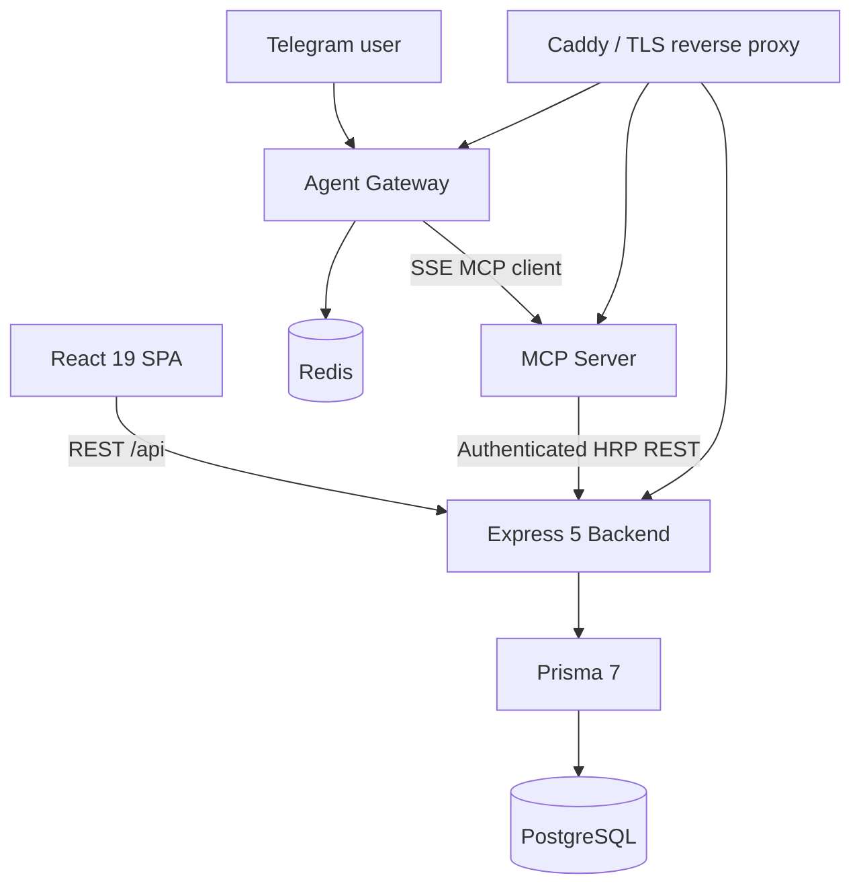
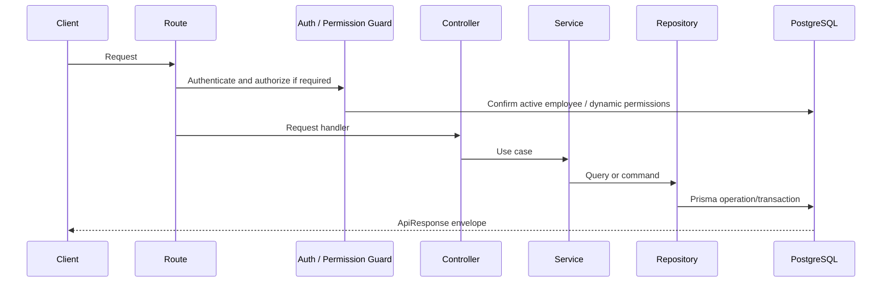

# System Architecture

**Status:** Current implementation baseline
**Last reviewed:** 2026-08-04
**Deep reference:** [Enterprise project documentation](enterprise-project-documentation.md)

## Overview

HRP is a four-package TypeScript monorepo. The backend is the system of record; browser and AI clients access it through controlled HTTP or MCP adapters.

| Component | Responsibility |
|---|---|
| Frontend | React Router UI, query/cache state, browser session refresh and permission-aware navigation |
| Backend | REST routes, workflow services, dynamic authorization, audit data, Prisma persistence and cron jobs |
| MCP server | Browser login, MCP SSE/stdio transports and authenticated tool facade |
| Agent gateway | Telegram bot, Redis state, OpenAI-compatible AI loop and session-injected MCP calls |

## Backend request lifecycle

Source ownership:

- Route modules: `backend/src/routes/`
- Controllers: `backend/src/controllers/`
- Business services: `backend/src/services/`
- Repositories: `backend/src/repositories/`
- Validation schemas: `backend/src/schemas/`
- Middleware: `backend/src/middlewares/`
- Data model: `backend/prisma/schema.prisma`

## Identity and access control

Authentication accepts an `access_token` cookie or Bearer token. The backend verifies JWT validity/version and confirms the employee remains active. It then resolves current role and permission assignments from the database; denial is the default outcome.

The frontend persists a client identity cache for usability but refreshes `/api/auth/me` before it trusts access on protected routes. It fails closed if authorization cannot be retrieved.

## Runtime jobs

After successful database startup, the backend enables three in-process jobs:

| Job | Function |
|---|---|
| Payroll cron | Generates and approves payroll according to persisted settings with duplicate and rejected-status guards |
| Weekly schedule cron | Generates employee shifts from applicable templates once per configured week |
| Capacity Copilot cron | Refreshes advisory project-capacity forecasts; it does not auto-staff teams |

The jobs use minute polling plus application-level guards. Production horizontal scaling requires distributed job coordination or a dedicated scheduler to prevent duplicate execution.

## Deployment

Production Compose uses Caddy as the public edge, Redis for gateway state, and separately built backend/MCP/gateway containers. Caddy routes `/api/*`, `/mcp/*` and gateway health traffic to internal services. GitHub Actions builds GHCR images, runs Prisma migrations on EC2, performs a Compose update, and checks health endpoints.

## Architecture decisions

- PostgreSQL + Prisma is the source of truth for HR, payroll, recruitment and delivery data.
- Business workflows use explicit services and dedicated state-transition operations instead of unconstrained generic CRUD.
- Dynamic RBAC is used instead of static role literals in authorization decisions.
- AI tool calls operate through MCP and a server-held session boundary rather than exposing backend credentials to the language model.

See [enterprise-project-documentation.md](enterprise-project-documentation.md) for data-domain diagrams, workflows, operational runbooks, integration inventory, security posture and backlog.
