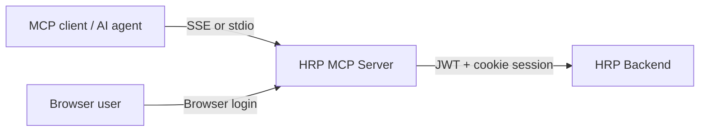

# HRP MCP Server

The HRP MCP Server exposes authenticated HRP operations as Model Context Protocol tools. It is an adapter between an MCP client/AI agent and the HRP backend; it does not own HR business data.

## Architecture



The server registers tool families for auth, employees/workforce, attendance, schedules, shifts, applications, approvals, payroll, projects, profile, holidays, shift changes and regimes. Tool handlers validate input with Zod and call backend domain services through the HTTP client layer.

## Transports and endpoints

| Mode | Use case |
|---|---|
| SSE | Remote MCP client or deployment behind Caddy/ngrok |
| stdio | Local MCP host that launches the process directly |

HTTP endpoints are mounted under `/mcp`:

- `GET /mcp/sse`
- `POST /mcp/message`
- `GET /mcp/auth/login?id=<loginId>`
- `POST /mcp/auth/submit`
- `GET /health`

The current SSE implementation keeps one active transport. A new connection closes the prior active transport.

## Browser login and sessions

1. An MCP client invokes the login-start tool.
2. The server creates a short-lived browser-login request and returns a public URL.
3. The user enters credentials only in the browser form.
4. The server authenticates with the HRP backend and stores backend token/cookie material in an internal MCP session.
5. Subsequent protected tools require that internal session; clients should never ask users to provide a session ID manually.

## Local setup

```powershell
Copy-Item .env.example .env
pnpm install
pnpm dev
```

| Variable | Purpose |
|---|---|
| `PORT` | HTTP server port; default 3001 |
| `HRP_API_BASE_URL` | Backend base URL |
| `PUBLIC_BASE_URL` | Public browser-login URL base; required for generated login URLs |
| `DEBUG` | Enables verbose diagnostics |

Build/start commands:

```powershell
pnpm build
pnpm start
node dist/server.js --stdio
pnpm test
```

## Extension rules

- Add tools through a domain `src/tools/*.tools.ts` module and register it in `src/mcp.ts`.
- Keep backend path constants, schemas and service mappings aligned with the backend route contract.
- Require a valid session for every business tool except the login flow.
- Add/maintain contract coverage when backend APIs change.

See [the root enterprise documentation](../docs/enterprise-project-documentation.md) for the full integration and security model.
